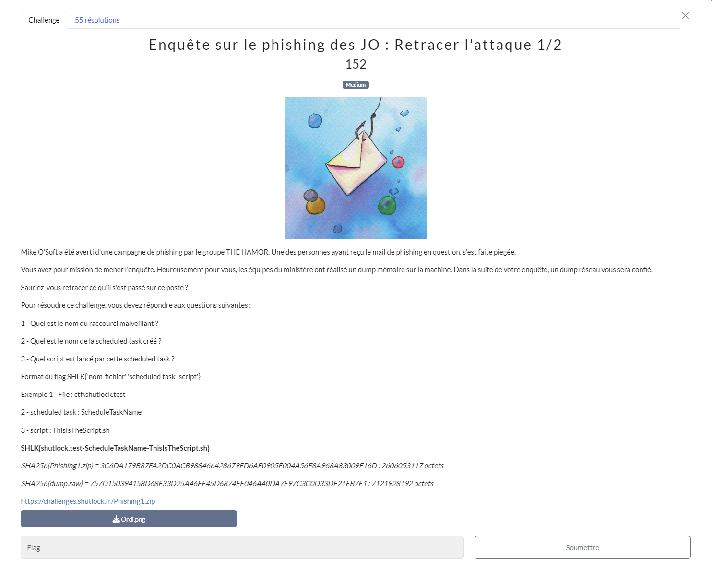
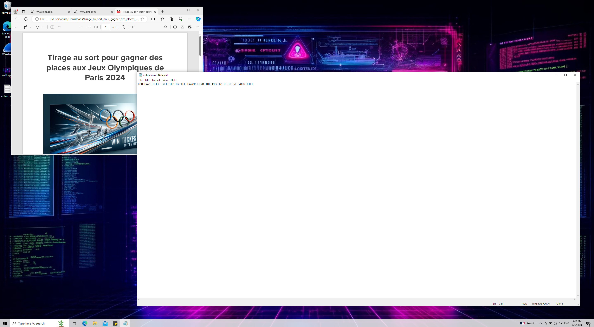
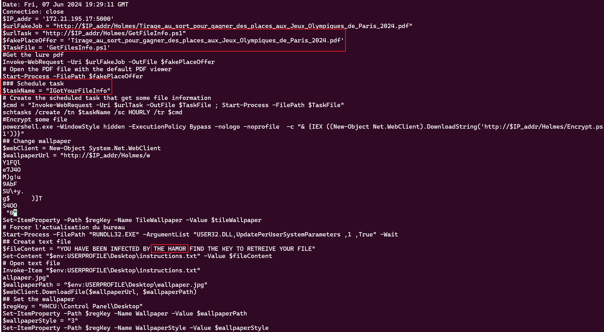

# Enquête sur le phishing des JO : Retracer l'attaque 1/2
## Challenge

<p align="center">
    
</p>

## Ressources
### dump.raw
Fichier non upload car trop lourd.
### Ordi.png
<p align="center">
    
</p>

## Solution
Pour ce challenge on nous fournit un dump windows que nous allons analyser avec *Volatility3*, ainsi qu'un screenshot que je n'avais même pas vu 😅.

Il s'agit de retrouver les fichiers et processus qui ont servis à réaliser une attaque de phishing.

N'étant pas expert en forensics, j'en ai profité pour tester un peu *Volatility*, en utilisant cette [Cheat Sheet](https://blog.onfvp.com/post/volatility-cheatsheet/) qui répertorie les commandes de base.

On peut aussi utiliser ```strings``` et ```grep``` avec des mots-clé :

```strings dump.raw | grep -i HAMOR``` -i permet de ne pas prendre en compte la casse.

Avec cette commande, on retrouve le contenu du fichier instructions.txt présent sur le screen : 

```$fileContent = "YOU HAVE BEEN INFECTED BY THE HAMOR FIND THE KEY TO RETREIVE YOUR FILE"```

Ensuite, avec l'option ```filescan```, on obtient le nom de tous les fichiers du système, on peut récuperer le retour de cette commande ```vol -f dump.raw windows.filescan``` dans un fichier pour ensuite explorer le home de Clara plus en détail avec ```grep```: 

```0xa70451a45a80  \Users\clara\Downloads\Tirage_au_sort_pour_gagner_des_places_aux_Jeux_Olympiques_de_Paris_2024\Tirage_au_sort_pour_gagner_des_places_aux_Jeux_Olympiques_de_Paris_2024.pdf.lnk```

On y trouve un lien (.lnk) sur un pdf des Jeux Olympiques, ce qui pourrait bien être le raccourci que l'on cherche.

Ensuite, on peut utliser d'autres options de *Volatility* ```pslist```, ```psscan``` et ```pstree``` pour trouver des informations sur les processus ainsi que leur PID.

```vol -f dump.raw windows.pstree```
```
12908   13428   notepad.exe     0xa704538e0080  1       -       1       False   2024-06-07 19:30:56.000000  N/A      \Device\HarddiskVolume1\Windows\System32\notepad.exe    "C:\Windows\system32\NOTEPAD.EXE" C:\Users\clara\Desktop\instructions.txt    C:\Windows\system32\NOTEPAD.EXE
```

N'ayant pas vu le screenshot en ressources, j'ai décidé de me pencher sur ce fichier instructions.txt et nottament le PID 12908 de *NotePad*.

On peut observer le comportement d'un PID avec : 

```vol -f dump.raw windows.handles --pid 12908```

On y retrouve notre fameux pdf ou lien symbolique :

```12908   notepad.exe     0xa70450058b30  0x40    File    0x100020        \Device\HarddiskVolume1\Users\clara\Downloads\Tirage_au_sort_pour_gagner_des_places_aux_Jeux_Olympiques_de_Paris_2024```

J'ai ensuite voulu extraire le dump mémoire du PID avec l'option ```memmap```, on peut le faire directement sur le PID 12908 (NotePad) avec cette commande:
```vol -f dump.raw -o "/path/to/dir" windows.memmap --dump --pid 12908```

Cela va nous donner un fichier ```pid.12908.dmp``` de type *Data*.
On peut faire un ```strings``` dessus et récupérer son retour dans un fichier, que l'on pourra ensuite explorer.

Je vais l'ouvrir avec un *vim* et rechercher "HAMOR" :

<p align="center">
    
</p>

Et je trouve le contenu du script malveillant, ainsi que les éléments manquants pour le flag.<br/>
On remarque que le fichier malveillant télécharge des scripts sur un serveur *http*, créé le fichier instructions.txt et change le fond d'écran par exemple.

PS : J'ai bien sûr essayé bien plus de commandes pour en arriver la. 

## Flag
```SHLK{Tirage_au_sort_pour_gagner_des_places_aux_Jeux_Olympiques_de_Paris_2024.pdf.lnk-IGotYourFilesInfo-GetFileInfo.ps1}```