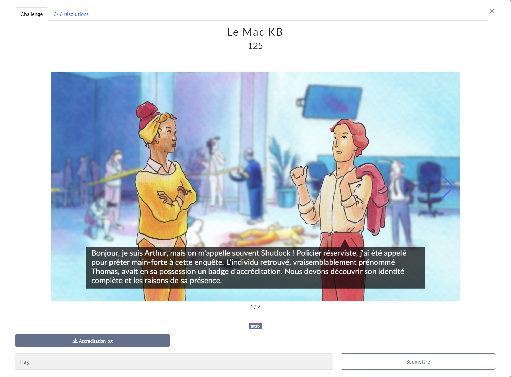
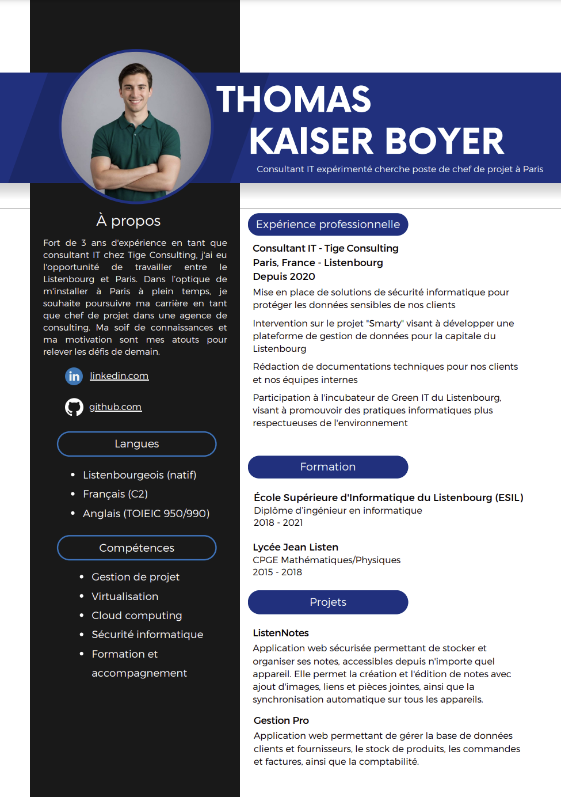
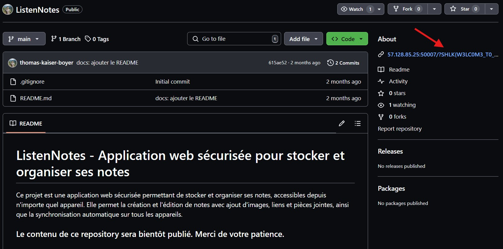
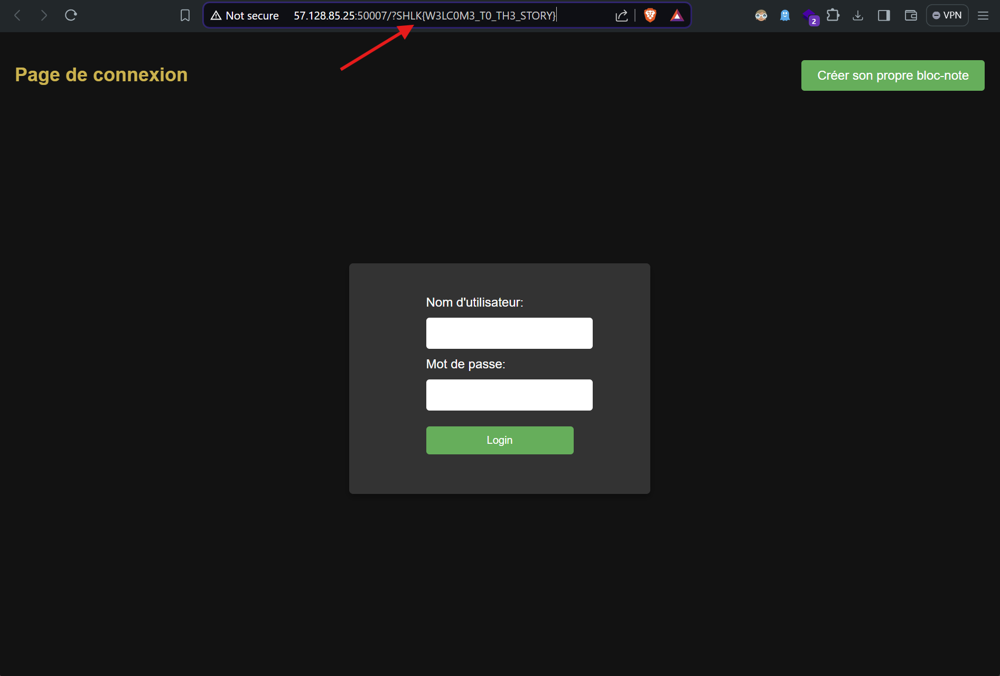

# Le Mac KB
## Challenge (OSINT)

<p align="center">
    
</p>
<p align="center">
    
</p>

## Ressources
<p align="center">
    
</p>

## Solution
Avec cette accréditation, on sait qu'il se prénomme "Thomas K." et qu'il est consultant IT chez Tige Consulting en France.

Après quelques investigations, on fini par trouver un certain Thomas Kaiser Boyer travaillant chez Tige Consulting sur linkedin : [https://www.linkedin.com/in/thomas-kaiser-boyer/](https://www.linkedin.com/in/thomas-kaiser-boyer/)

Sur sa page linkedin, Thomas à posté son CV sur lequel il y a un lien github.

<p align="center">
    
</p>

[https://www.github.com/thomas-kaiser-boyer](https://www.github.com/thomas-kaiser-boyer)

En explorant ce github, on voit un début de flag dans la partie "About" sur la droite de la page.

<p align="center">
    
</p>

Ce lien nous mène vers un autre site contenant le flag dans l'url.

<p align="center">
    
</p>

## Flag
```SHLK{W3LC0M3_T0_TH3_STORY}```