# Une clé USB qui ouvre des portes
## Challenge (Reverse)

<p align="center">
    
</p>
<p align="center">
    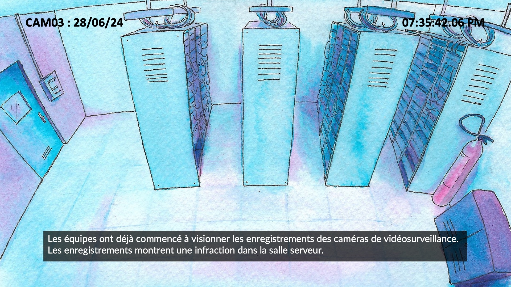
</p>
<p align="center">
    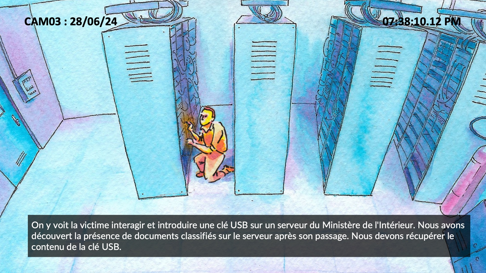
</p>
<p align="center">
    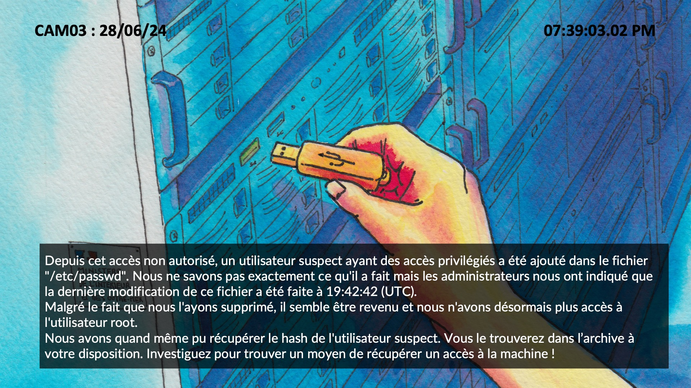
</p>
<p align="center">
    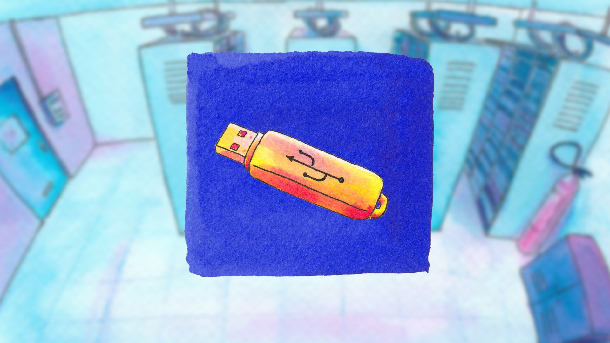
</p>

## Ressources

### image.raw
Fichier non upload.

### user.hash
```newsuperuserforwin:$6$NBYlg3a0nG8eykJg$KnzV/9n5DpRkeNHLcdXfviKsh0Z9NaPQdXg9Pd4nBOXuN6gr3dfAHxo71Y/dCGvG5kei3Y8ganUcz1RqrdTUt/:0:0::/root:/bin/sh```

## Solution

Dans ce challenge, on nous fournit une clé USB.

Je vais commencer par regarder ce qu'il y a à l'intérieur en la démarant avec *qemu*, tout en partageant un dossier avec l'host pour pouvoir y récupérer des fichiers.

Commande pour lancer l'émulation avec un dossier partagé :

```
qemu-system-x86_64 \
    -enable-kvm \
    -m 512 \
    -cpu host \
    -drive file=image.raw,format=raw \
    -fsdev local,id=myid,path=/home/melperri/share,security_model=none \
    -device virtio-9p-pci,fsdev=myid,mount_tag=myshare
```

Il faut préalablement changer les droits sur le dossier partagé avec ```chmod``` pour pouvoir y accéder dans les deux machines.

On y trouve un script shell caché dans le home.

Ce script contient un éxècutable sous forme de *base64*, le décode, puis l'éxècute dans la machine dans laquelle la clé USB sera insérée.<br/>
On peut donc reconsistuer le fichier binaire pour essayer de le reverse.

Lorsque l'on décompile le programme à l'aide de *Ghidra*, on comprend que cette clé USB est un *RubberDucky*, elle va modifier le /etc/passwd de la machine dans laquelle elle sera insérée dans le but d'obtenir des accès root.

On remarque deux fonctions dans le main :

* PwnNerD
* IamPWNED

<p align="center">
    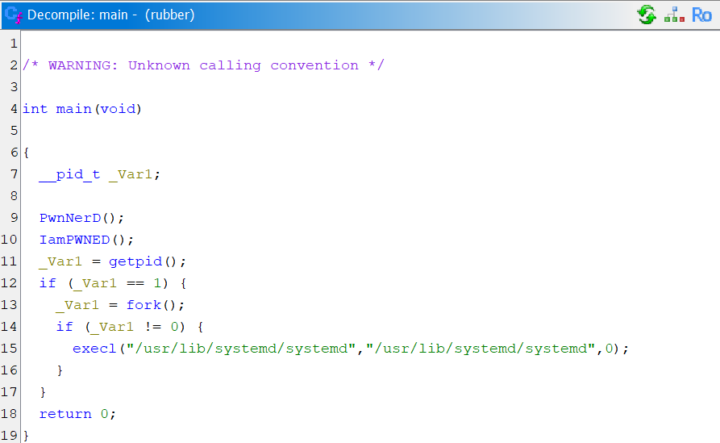
</p>

Commençons par regarder *PwnNerd*, qui nous suffira pour récupérer le flag.

### PwnNerd 
<p align="center">
    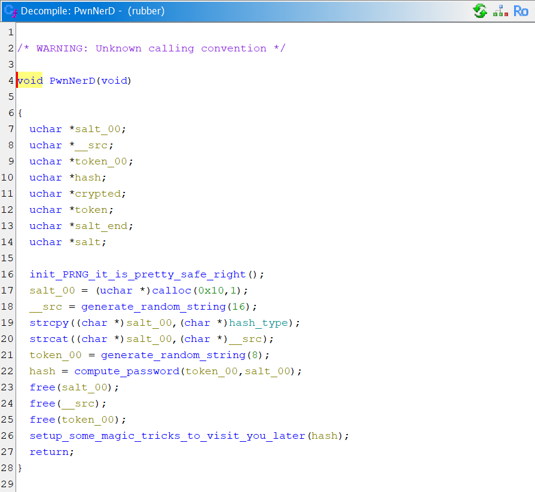
</p>

Cette fonction appelle d'abord *init_PRNG_it_is_pretty_safe_right* :

<p align="center">
    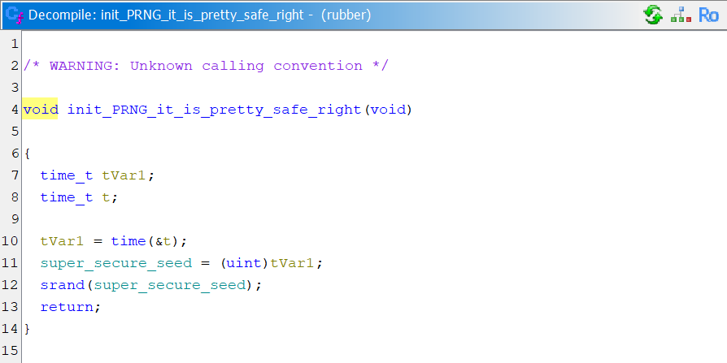
</p>

Elle fait une initialisation de *seed* pour ensuite utiliser *srand*.

Pour initialiser la *seed*, ce programme utilise *time*, donc un timestamp basé sur l'heure à laquelle sera éxècuté ce programme.

Ça tombe bien, nous connaissons l'heure à laquelle la clé a été insérée (19h42m42s UTC). On peut donc retrouver la valeure de la variable *super_secure_seed* avec [epochconverter](https://www.epochconverter.com/).<br/>

Ce qui nous donne : ```super_secure_seed = 1719603762```.

*PwnNerd* fait ensuite quelques manipulations qui consiste à générer des chaines de charactères de manières "random", pour au final les concaténer avec *hash_type* qui vaut ```$6$```.

Elle génère les chaines de charactères à partir de ces deux fonctions :

<p align="center">
    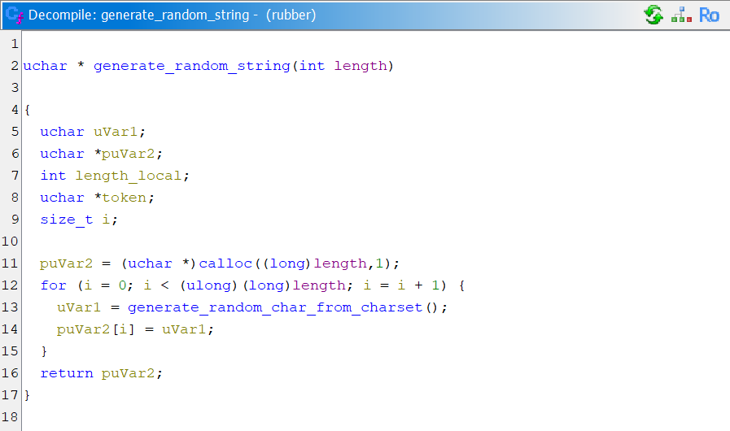
</p>

<p align="center">
    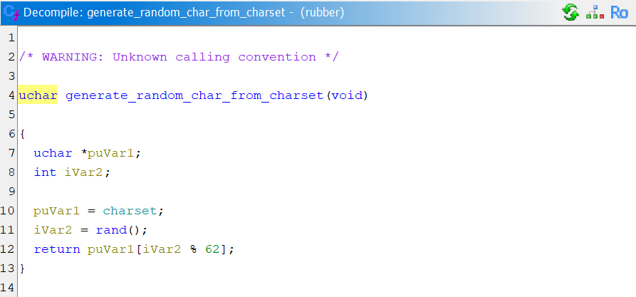
</p>

On remarque un appel de *rand* qui ne posera pas de problème, comme expliqué précédement.

Ensuite, *PwnNerd* appelle *compute_password* :

<p align="center">
    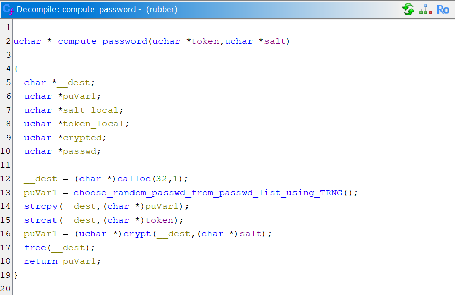
</p>

Cette fonction concatène les chaines de charactères générées précédement avec une nouvelle chaine de charactère choisie dans un double tableau global, on peut donc retrouver cette liste en mémoire.

<p align="center">
    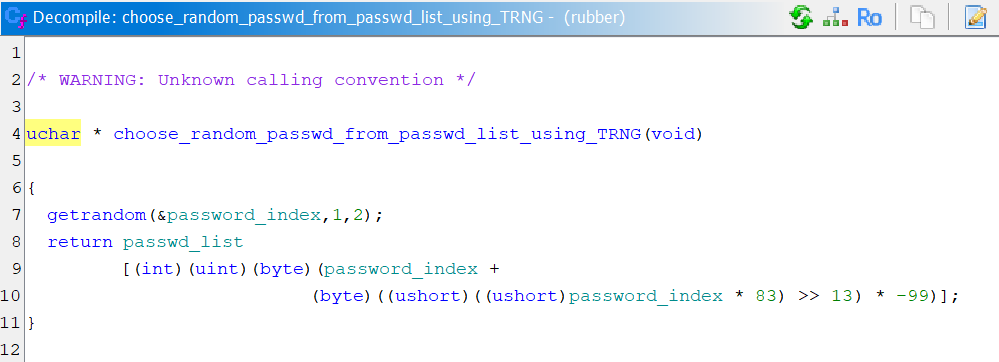
</p>

Une fois ceci fait, *compute_password* créé un hash à partir de cette chaine avec *crypt*.

Pour finir *PwnNerd* appelle *setup_some_magic_tricks_to_visit_you_later*, qui prend en paramètre la variable *hash* final. Cette fonction modifie */etc/passwd* avec pour mot de passe, la variable *hash*.

Avec toute ces informations, on peut écrire un code en C qui nous affichera un hash pour chaque ligne du double tableau.
On pourra ensuite comparer chaque résultat avec le *user.hash* en ressource pour trouver le bon hash.

Il faut penser à compiler avec -lcrypt :

```C
#include <stdio.h>
#include <stdlib.h>
#include <sys/random.h>
#include <string.h>
#include <unistd.h>

int main(void) {
	
	char list[101][30] = { "backflip2\0", "backflip17\0", "backflip16\0", "backflip15\0", "backflip147\0", "backflip123\0", "backflip12\0", "backflip101\0", "backflip060495!\0", "backflip0\0", "backflip.\0", "backfliplayout\0", "backflic\0", "backflex\0", "backflash\0", "backfl1p\0", "backfist1\0", "backfist\0", "backfire39\0", "backfire13117\0", "backfire07\0", "backfire!\0", "backfileedit\0", "backfighter\0", "backfield1\0", "backfeather\0", "backfat8\0", "backfat1\0", "backfat.\0", "backfat\0", "backetball1991\0", "backetball\0", "backet\0", "backerz\0", "backeryman\0", "backery\0", "backerstraat\0", "backers4009\0", "backers35\0", "backers23\0", "backerpumita.14\0", "backerij\0", "backer58\0", "backer49\0", "backer44\0", "backer41\0", "backer40\0", "backer34\0", "backer24\0", "backer1228\0", "backer1\0", "backer09\0", "backer07\0", "backer01\0", "backer&\0", "backenzie\0", "backenupp\0", "backend1\0", "backend08\0", "backen33\0", "backen1\0", "backelem\0", "backedu\0", "backedneans\0", "backed\0", "backeast\0", "backe123456789\0", "backe#41\0", "backdry\0", "backdrop\0", "backdrafts\0", "backdraft86\0", "backdraft3342\0", "backdraft06\0", "backdraft.\0", "backdown9\0", "backdown25\0", "backdown0\0", "backdor\0", "backdoorlover\0", "backdoor@#&*9\0", "backdoor912\0", "backdoor831\0", "backdoor82\0", "backdoor789\0", "backdoor76\0", "backdoor75\0", "backdoor66\0", "backdoor44\0", "backdoor1993\0", "backdoor11\0", "backdoor0\0", "backdoor.\0", "backdive\0", "backdeptrai\0", "backden1\0", "backden\0", "backdella\0", "backdeck\0", "backdeath\0", 0};

	unsigned char charset[63] = "0123456789abcdefghijklmnopqrstuvwxyzABCDEFGHIJKLMNOPQRSTUVWXYZ";
	charset[63] = 0;
	printf("charset %s\n", charset);
	unsigned char salt[17] = {0};
	salt[17] = 0;
	unsigned char token[9] = {0};
	token[9] = 0;
	unsigned char password[33] = {0};
	password[33] = 0;

	int secure_seed = 1719603762;
	int pos = 0;
	int password_index;
	getrandom(&password_index,1,2);
	

	printf("random index : %d\n", password_index);

	srand(secure_seed);

	for (int i = 0; i < 16; i++) {
		pos = rand();
		salt[i] = charset[pos % 62];
	}
	printf("salt : %s\n", salt);

	for (int i = 0; i < 8; i++) {
		pos = rand();
		token[i] = charset[pos % 62];
	}
	printf("token : %s\n", token);

	char *dest = NULL;
	char *final = NULL;
	char *final_salt = malloc(20);
	final_salt[0] = '$';
	final_salt[1] = '6';
	final_salt[2] = '$';

	for (int i = 0; i < 100; i++) {
			printf("%d : %s\n", i, list[i]);
			dest = strcat(list[i], token);
			printf("%d : %s\n", i, dest);
			final = crypt(dest, strcat(final_salt, (char *)salt));
			printf("%s\n", final);
	}
	
	return 0;
}
```

Il fallait trouver le mot de passe, et non pas la chaine de charactère entière.

Le flag est donc l'entrée de la liste + le token.

## Flag
```SHLK{backdoor8314x9mWPW7}```