# Qui a laissé trainer son bloc note ?
## Challenge (Web)

<p align="center">
    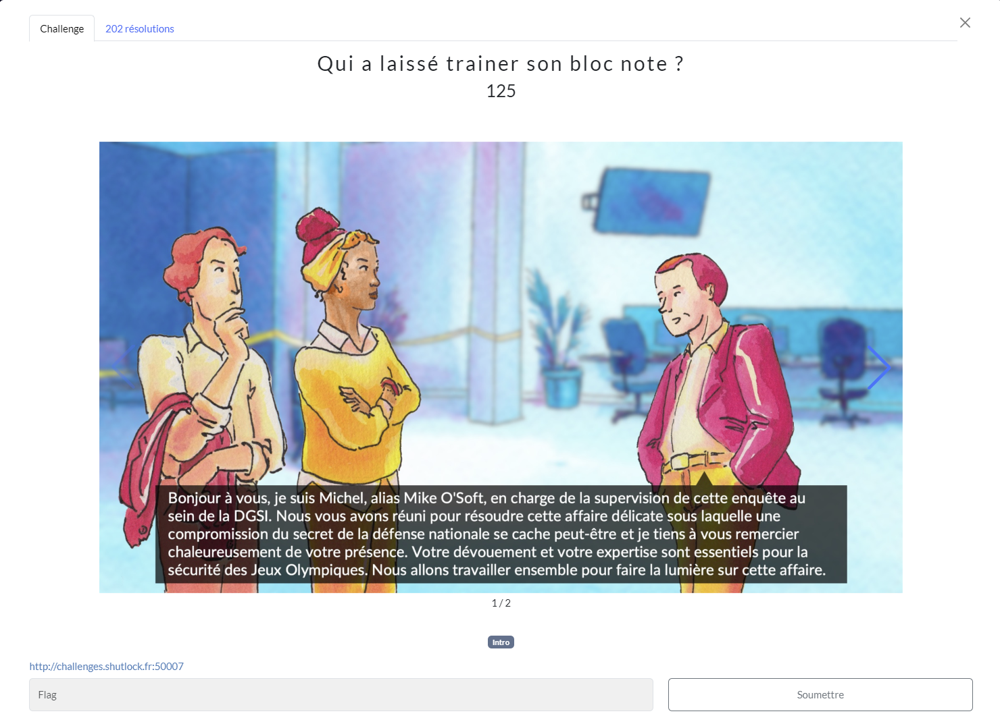
</p>
<p align="center">
    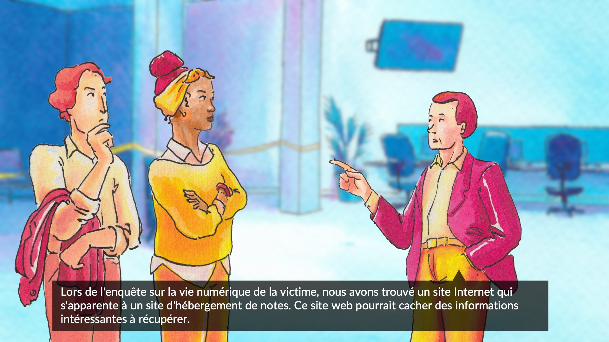
</p>

## Solution

Dans ce challenge qui est la suite de "Le Mac KB", nous arrivons sur une page de login.

<p align="center">
    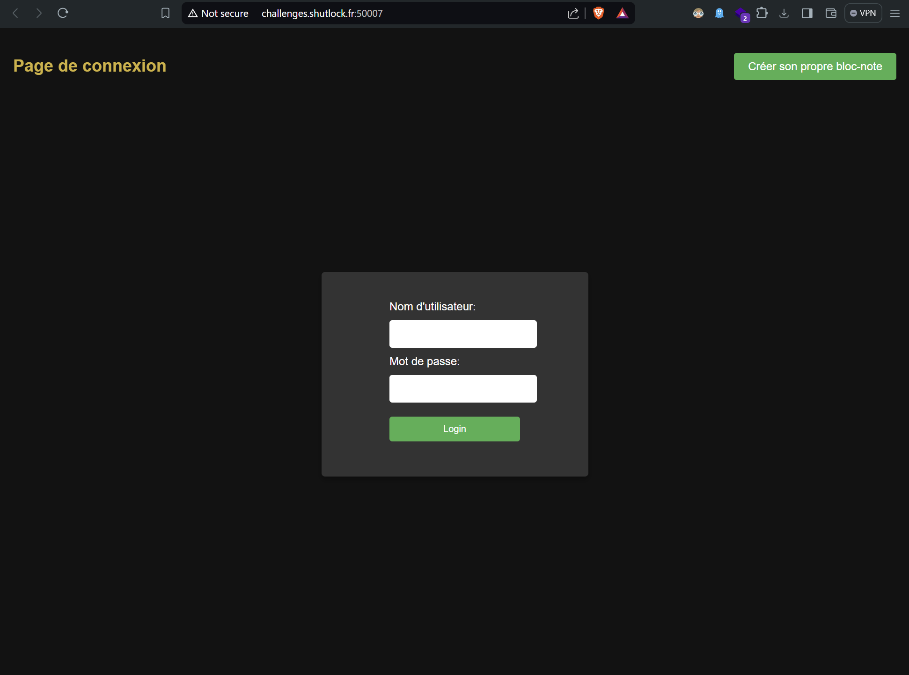
</p>

Lorsque qu'on essaye de se connecter avec des credentials au hasard, on est redirigé sur une page qui nous dit que l'on a pas les accès pour aller sur la page */admin*. On remarque à ce moment là un token dans l'url, qui semble être un jwtoken.


<p align="center">
    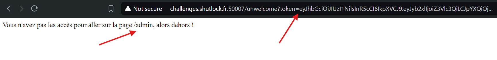
</p>

Je vérifie le contenu de ce token sur le site [jwt.io](https://jwt.io/).<br/>
C'est bien un jwtoken, qui nous donne un rôle d'accès *guest*.

<p align="center">
    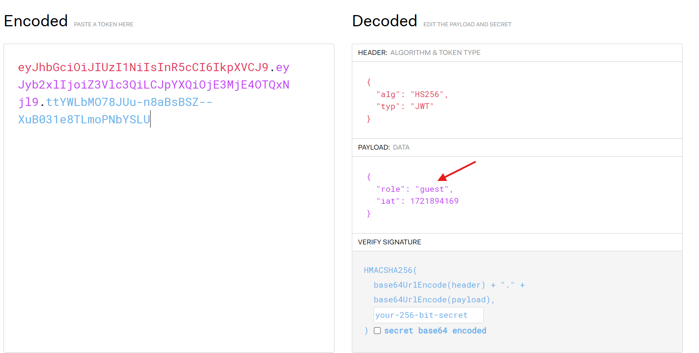
</p>

J'ai d'abord essayé de le modifier en remplaçant "guest", par "admin", le type d'algorythme par "none", ainsi qu'en supprimant la signature car j'avais déjà utilisé cette technique par le passé.

Cette fois-ci ça ne fonctionne pas, il semblerait que le token soit signé.<br/>
Ce n'est que quelques jours plus tard, après avoir fait d'autres challenges que je suis revenu sur celui là avec un peu de recule.

Je trouvai bizarre le bouton "Créer son propre bloc-note" qui n'avait aucun comportement. J'ai donc décidé de l'inspecter, et j'ai bien fait car le développeur y a laissé un commentaire.

<p align="center">
    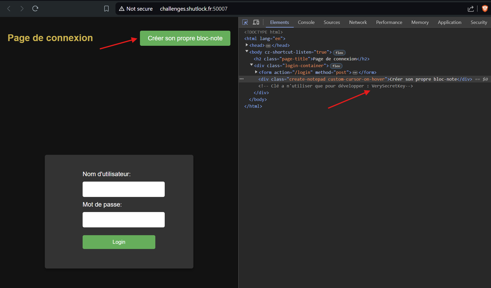
</p>

Je vais donc essayer d'intercepter la requête avec *Burpsuite*, modifier le token pour me donner un rôle *admin* et le signer avec "VerySecretKey".

<p align="center">
    
</p>

Le token est différent de celui des premiers screens car il est regénéré à chaque requête, il faut le récupérer et le modifier à chaque tentative.

Lorsque l'on intercepte, on a d'abord une requête *POST*, que l'on peut *forward* avec *Burp*.

<p align="center">
    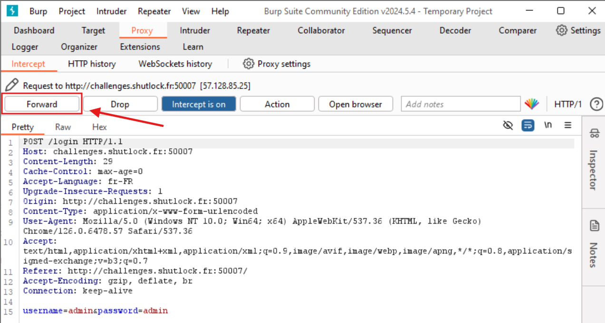
</p>

On a ensuite une requête *GET*.

<p align="center">
    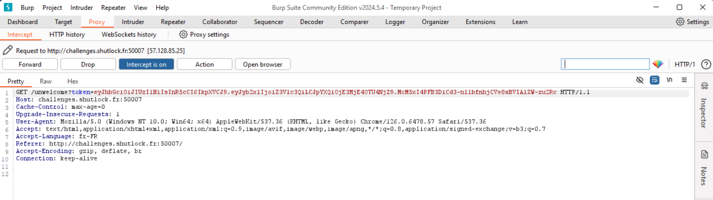
</p>

À ce moment là, on peut modifier notre token. Via *Burp* ou directement sur le site [jwt.io](https://jwt.io/).
J'ai choisi la deuxième option, ce qui nous donne :

<p align="center">
    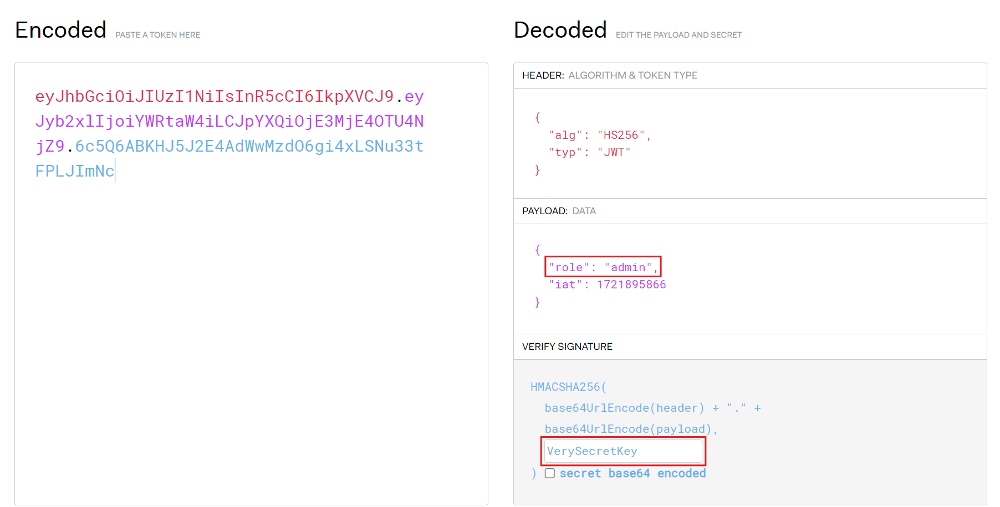
</p>

Il n'y a plus qu'à modifier la requête intercepté, je remplace aussi la route */unwelcome* par */admin* comme indiqué dans le message d'erreur du début. Pour ce qui est de modifier la route, je ne l'ai pas trouvé au premier essai.

<p align="center">
    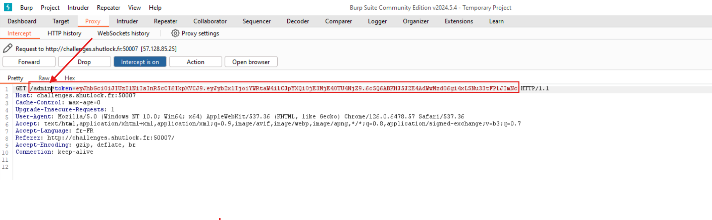
</p>

On a finalement les accès admin, le Flag, ainsi qu'un canal *Telegram* qui pourra servir dans un prochain challenge.

<p align="center">
    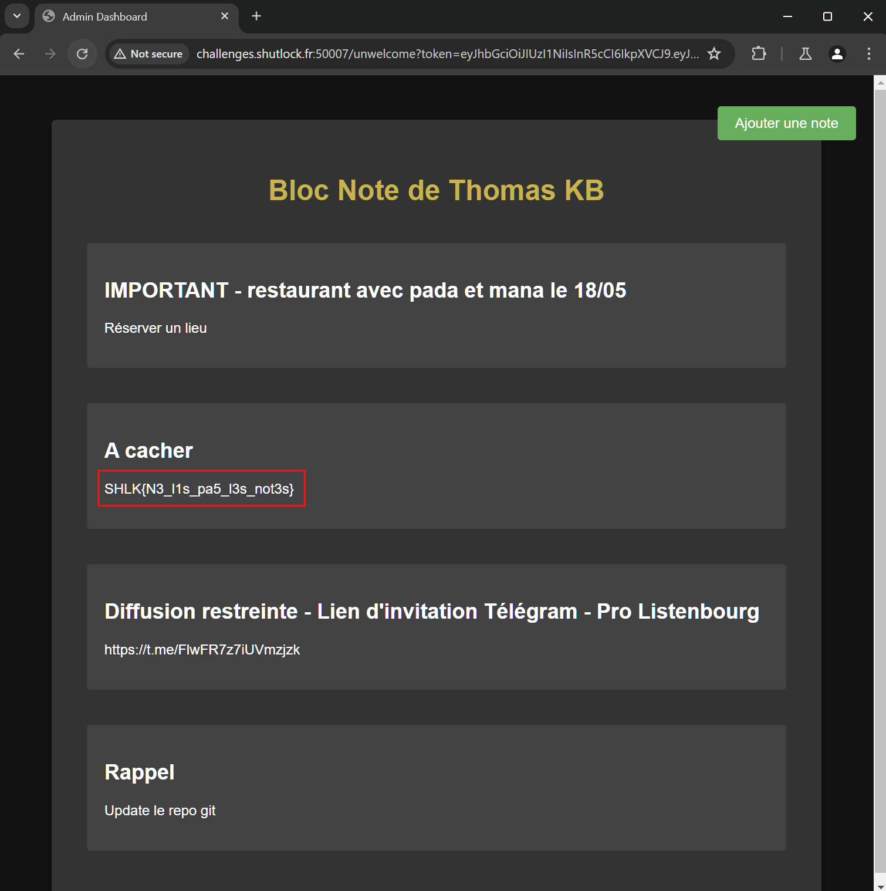
</p>

## Flag
```SHLK{N3_l1s_pa5_l3s_not3s}```