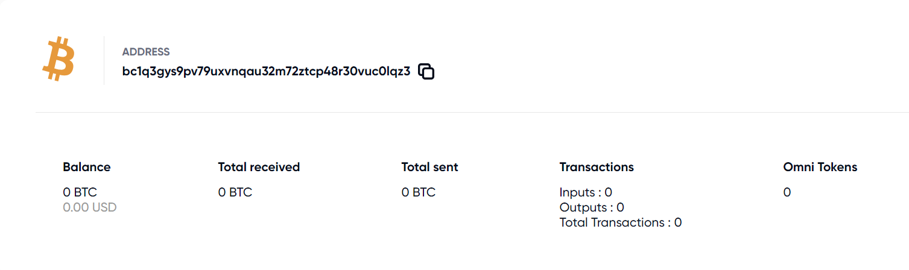
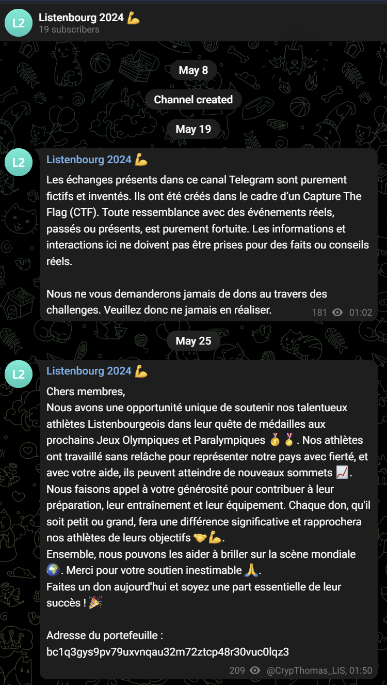
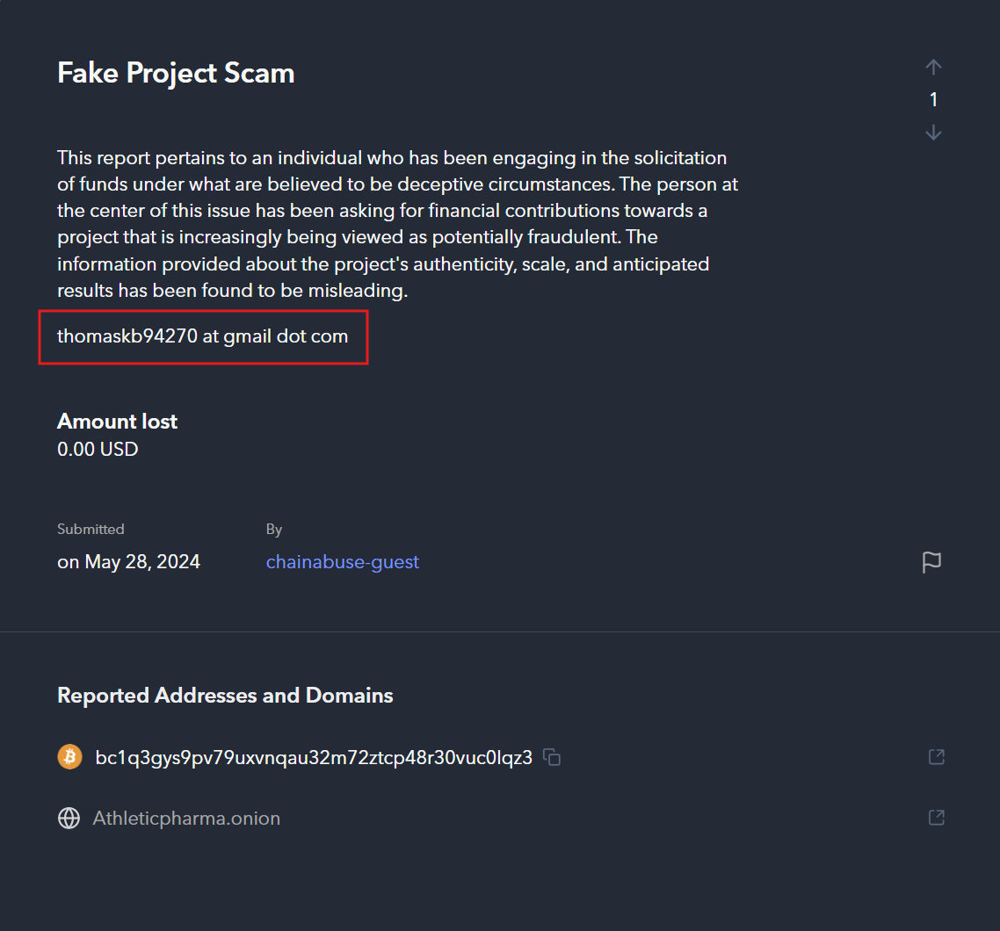
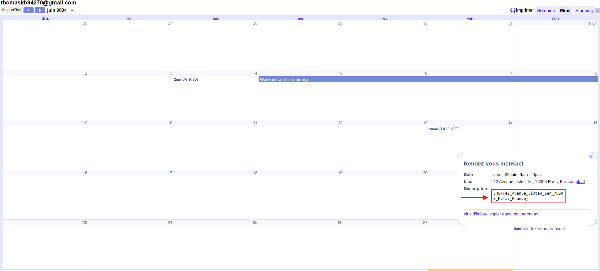

# Le Quêteur Démasqué
## Challenge (OSINT)

<p align="center">
    
</p>
<p align="center">
    
</p>

## Ressources
#### adresse.txt

```bc1q3gys9pv79uxvnqau32m72ztcp48r30vuc0lqz3```

## Solution

Pour ce challenge, nous commençons avec une adresse de cryptomonnaie.
On peut donc commencer par chercher à quel type de cryptomonnaie est associé cette adresse. Pour ce faire, il existe différent explorateur de blockchain comme [blockexplorer](https://blockexplorer.one).

On sait déjà que c'est une adresse de *bitcoin* car elle commence par ```bc1```, mais cherchons quand même pour voir si il y a eu des transactions effectuées avec cette adresse.

Résultat de la recherche : 
* https://blockexplorer.one/bitcoin/mainnet/address/bc1q3gys9pv79uxvnqau32m72ztcp48r30vuc0lqz3

<p align="center">
    
</p>

Malheureusement, tous les compteurs sont à zero... J'ai fait pas mal de recherches et tentatives mais je suis resté bloqué sur ce challenge un bon moment.

Cependant, ce challenge fait bien partie de la catégorie *OSINT* et non pas *Web3*, l'énoncé fait référence à un appel au don visant à soutenir le Listenbourg, et on avait justement récupéré un canal *Telegram* à la fin du challenge *"Qui a laissé trainer son bloc note ?"*

Canal Telegram :<br/>
https://t.me/s/FlwFR7z7iUVmzjzk

<p align="center">
    
</p>


Il s'avère que beaucoup d'arnaques autour du *Listenbourg* existe déjà. N'y connaissant rien en *Web3*, c'est grâce à notre ami à tous *ChatGPT* que j'ai découvert l'existence de sites qui référencent les arnaques liés à une adresse de cryptomonnaie comme [chainabuse](https://www.chainabuse.com/).

Et ça tombe bien car notre adresse a été signalé sur ce site :<br/>
https://www.chainabuse.com/address/bc1q3gys9pv79uxvnqau32m72ztcp48r30vuc0lqz3

<p align="center">
    
</p>


On y trouve une adresse mail au nom de *thomaskb*, avec les charactères spéciaux écrit en toute lettre : ```thomaskb94270 at gmail dot com```

Ce qui nous donne : ```thomaskb94270@gmail.com```

Lorsque l'on trouve une adresse *gmail*, on peut la scanner à l'aide de [epieos](https://epieos.com/).<br/>
Si l'utilisateur l'a laissé en public, on pourra accéder à certaines informations intéressantes.

En rentrant ce mail dans epieos, tout est en public.<br/>
On peut donc accéder à son calendrier qui contient un rendez-vous mensuel sur lequel on peut voir le flag!

<p align="center">
    
</p>

## Flag
```SHLK{42_Avenue_Listen_1er_75003_Paris_France}```