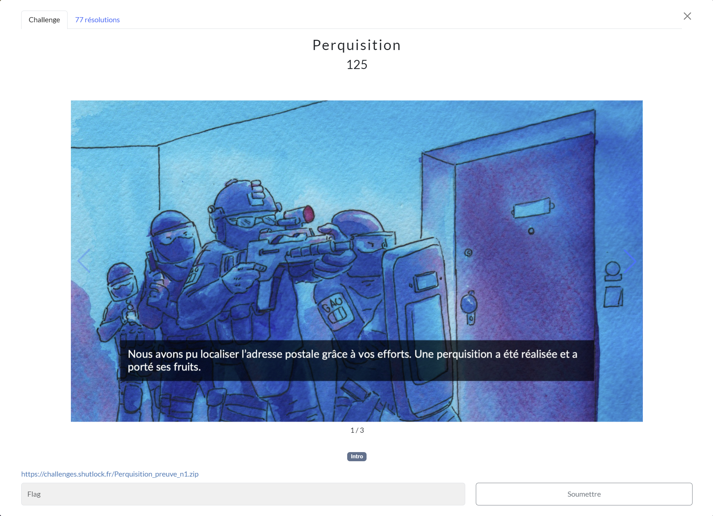
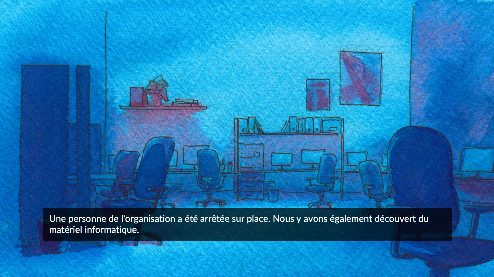
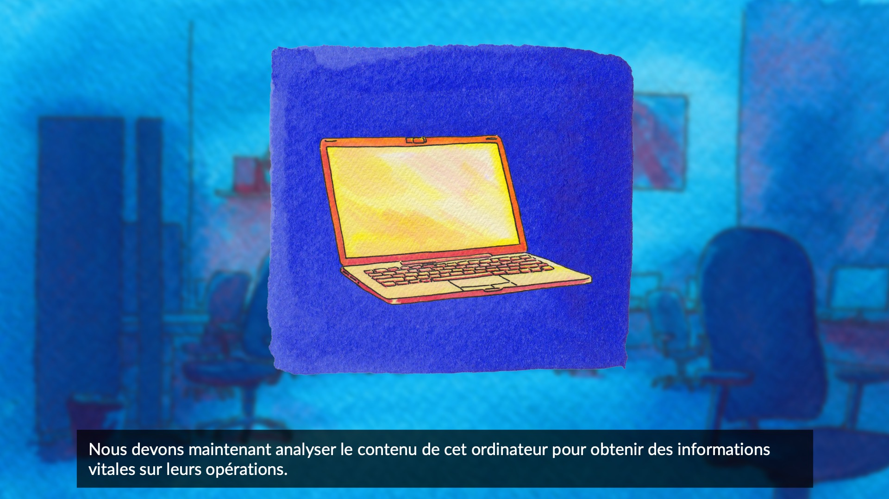

# Perquisition
## Challenge (Forensics)

<p align="center">
    
</p>
<p align="center">
    
</p>
<p align="center">
    
</p>

## Ressources
### Perquisition_preuve_n1.zip
* Fichier non upload car trop lourd.

## Solution
Après avoir dézipé l'archive, on obtenait un ```.vdi``` qui est l'extension pour une image de disque virtuel *VirtualBox*.

J'ai à peine eu le temps de tester la commande ```strings Perquisition_preuve_n1.vdi | grep SHLK``` pour voir si le flag n'était pas écrit en clair qu'il est apparu..

## Flag
```SHLK{d4rkweb_l1nk_f0und}```