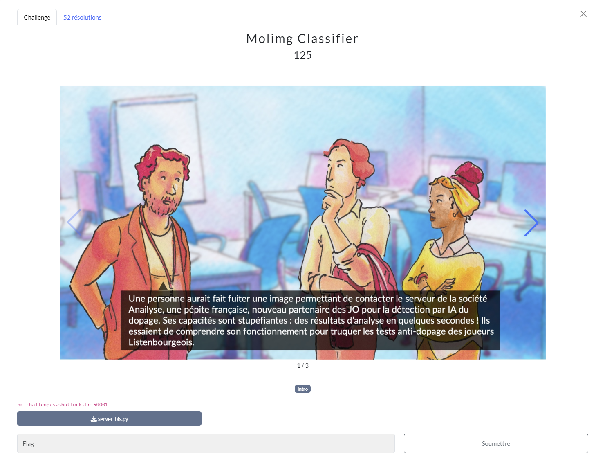
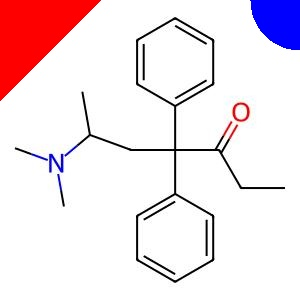
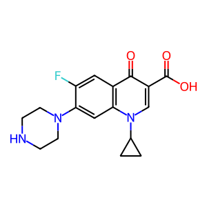

# Molimg Classifier
## Challenge (Misc)

<p align="center">
    
</p>
<p align="center">
    
</p>
<p align="center">
    
</p>

## Ressources
* server-bis.py

## Solution
Dans ce challenge un serveur nous envoie des images en *base64*, nous devons lui répondre "dopante" ou "non-dopante" selon le type de molécule.

Comme on peut le voir dans le script *server-bis.py* en ressources, les molécules dopantes sont des *jpg* et les non dopantes des *png*.

La [documentation png](http://www.libpng.org/pub/png/spec/1.2/PNG-Structure.html) nous informe que les premiers bytes du header d'un fichier png sont toujours les mêmes ```137 80 78 71 13 10 26 10```.

De plus j'ai remarqué que le serveur nous envoyait à chaque fois 50 images seulement et que les images étaient envoyées en chunks.

J'en ai récupéré une de chaque type pour le fun.

* Dopante :
<p align="center">
    
</p>

* Non-Dopante :
<p align="center">
    
</p>

Voici le script qui m'a permis de récupérer le flag, il boucle 50 fois pour répondre à chaque image, et regarde si le premier octet est égal à 137. Dans ce cas, c'est un *png* et donc une molécule ```non-dopante```. Dans les autres cas ce sera un *jpg* et donc une molécule ```dopante```.

```python
#!/usr/bin/python3
from pwn import *
import base64
from PIL import Image
from io import BytesIO

conn = remote('challenges.shutlock.fr',50001)
conn.sendline(b'go')

key = conn.recv()
print(f"KEY = {key.decode()}")
conn.send(b'ack')
img_chunk = conn.recv()

j = 0
while j < 50:
    i = 0
    while len(img_chunk.decode()) > 5:
        print(f"CHUNK = {img_chunk.decode()}")
        if i == 0:
            img_begin = base64.b64decode(img_chunk.decode())
            if img_begin[0] == 137:
                conn.send(b'non-dopante')
            else:
                conn.send(b'dopante')
        img_chunk = conn.recv()
        i += 1
    conn.send(b'ack')
    img_chunk = conn.recv()
    j += 1
```

PS: Le script boucle une fois de trop mais le flag étant obtenu, je l'ai laissé tel quel.

## Flag
```SHLK{D0piNG_DEteCt10n_1S_TO_EAsY}```