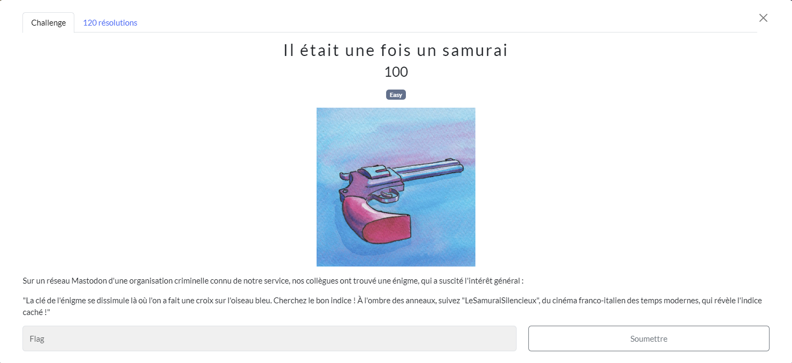
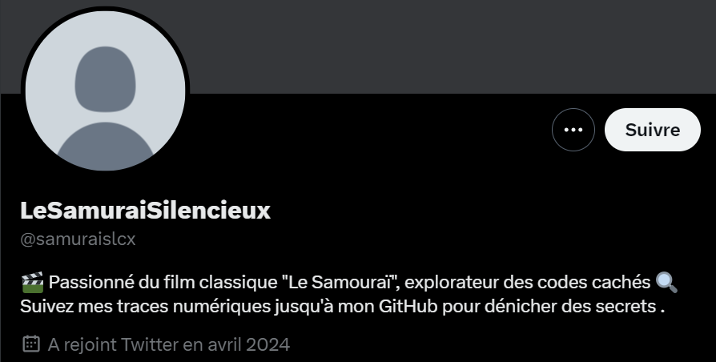
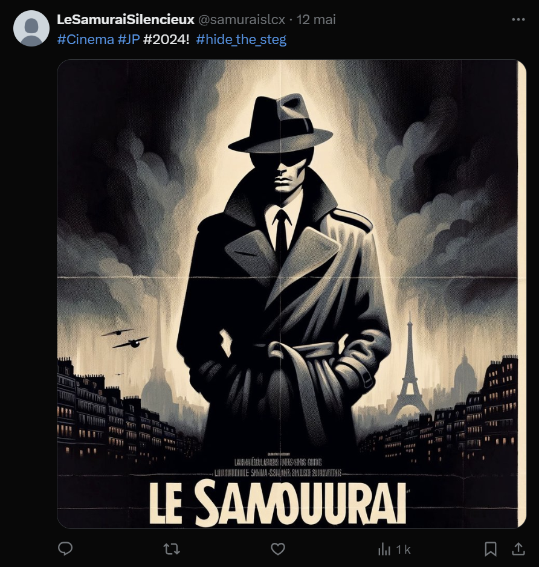

# Il était une fois un samurai
## Challenge

<p align="center">
    
</p>

Sur un réseau Mastodon d'une organisation criminelle connu de notre service, nos collègues ont trouvé une énigme, qui a suscité l'intérêt général :

"La clé de l'énigme se dissimule là où l'on a fait une croix sur l'oiseau bleu. Cherchez le bon indice ! À l'ombre des anneaux, suivez "LeSamuraiSilencieux", du cinéma franco-italien des temps modernes, qui révèle l'indice caché !"

## Solution

```La clé de l'énigme se dissimule là où l'on a fait une croix sur l'oiseau bleu```

Le début de l'énigme fait référence à Twitter devenu [X](https://x.com).

En cherchant "LeSamuraiSilencieux" sur *X*, on trouve un compte : https://x.com/samuraislcx

<p align="center">
    
</p>

Celui-ci nous demande de suivre ses traces numériques jusqu'à son *Github* pour dénicher ses secrets.

Si l'on cherche "LeSamuraiSilencieux" sur *Google*, on trouve directement les 2 comptes et quelques scans *sherlock* ne donne rien de plus.

https://www.github.com/LeSamuraiSilencieux

Sur le *Github*, on trouve un ReadMe, ainsi qu'une image (final.jpg).

#### ReadMe :
```
Scrutez attentivement les hashtags du dernier post du 12/05, car ils recèlent des vérités cruciales pour votre quête.
Vous devrez faire appel à un outil mystérieux, capable de révéler ce qui est invisible aux yeux des profanes. 
Cet outil est connu pour sa capacité à extraire des messages cachés dans des images. 
Le mot de passe requis se cache derrière un voile de discrétion, mais un indice vous mettra sur la voie :
#CinemaJP2024!
```

La première partie de ce ReadMe nous demande d'aller voir le post du 12/05 que voici :

<p align="center">
    
</p>

Il contient la même image que celle dans le repo git (final.jpg).

Le dernier hashtag *#hide_the_steg* nous aide à trouver *steghide*, un outil de stéganographie qui permet de cacher des données dans une image ou de les extraire, ainsi que de les protéger par un mot de passe.

On peut donc essayer d'extraire des données de l'image sur *Github* avec cette commande :

```steghide extract -sf final.jpg```

Mais celle-ci est protégée par un mot de passe.

La deuxième partie du ReadMe nous donne des indices pour trouver le mot de passe : 

```
Le mot de passe requis se cache derrière un voile de discrétion, mais un indice vous mettra sur la voie :
#CinemaJP2024!
```

J'ai eu beau essayer plusieurs dizaines de mot de passe en me basant sur les indices récoltés, je n'ai pas trouvé. J'ai donc mis ce challenge en pause...

Quelques jours plus tard, je passe l'image dans [aperisolve](https://www.aperisolve.com/), je découvre une adresse email dans les logs du .git ```samurai.silenciuex117@outlook.fr``` mais ca ne mène à rien.

C'est à force d'essayer différents mot de passe que j'ai finalement enlevé le # du hashtag ```#CinemaJP2024!```, le # étant le voile de discrétion. 

```CinemaJP2024!``` est donc le mot de passe valide pour extraire un fichier *secret.txt* qui contenait ce message : ```The flag is SHLK{Gé5a5d_M0ul1n}!```

## Flag
```SHLK{Gé5a5d_M0ul1n}```