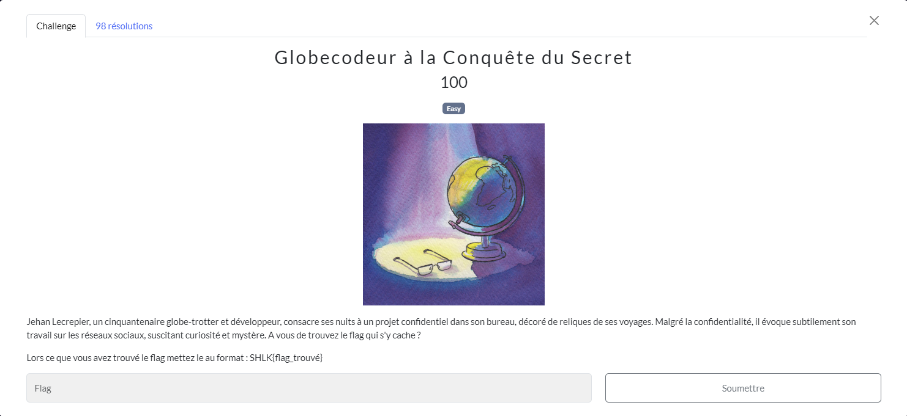
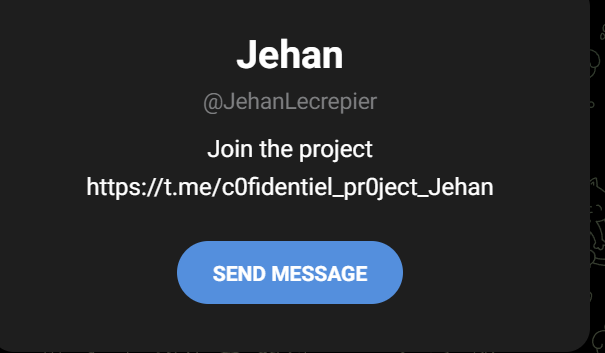
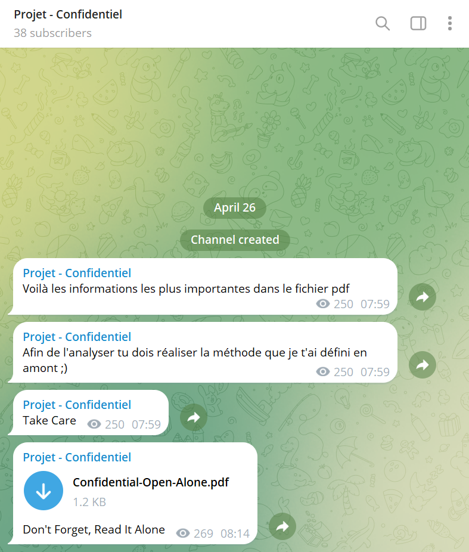
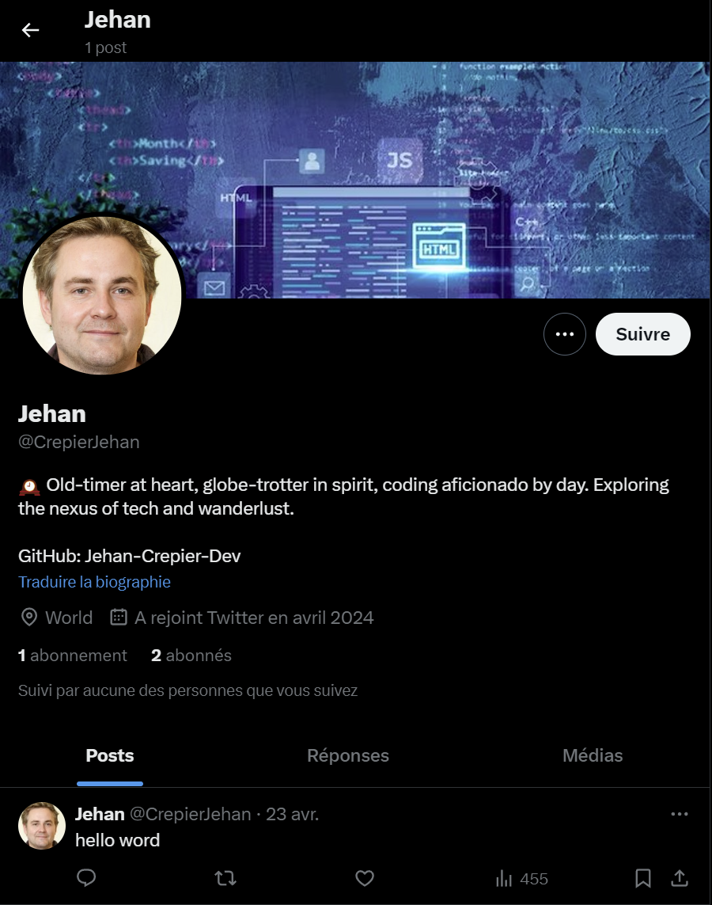
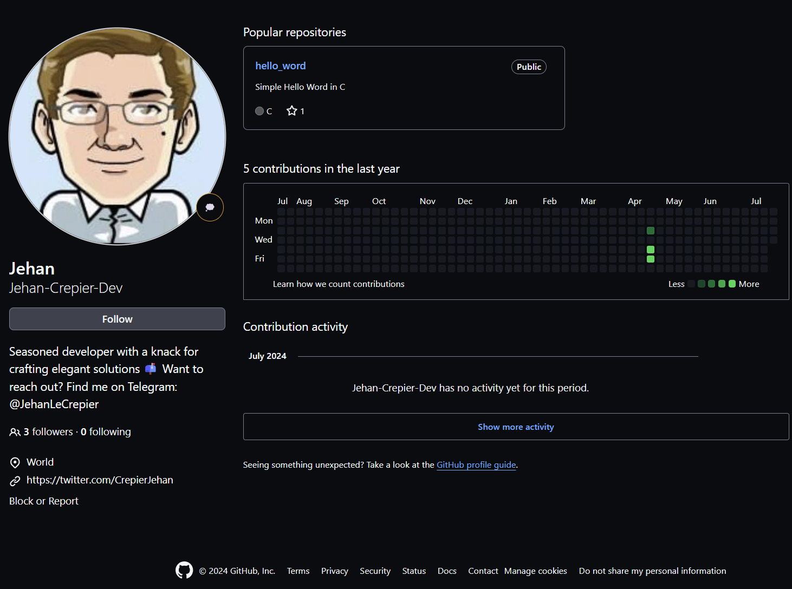
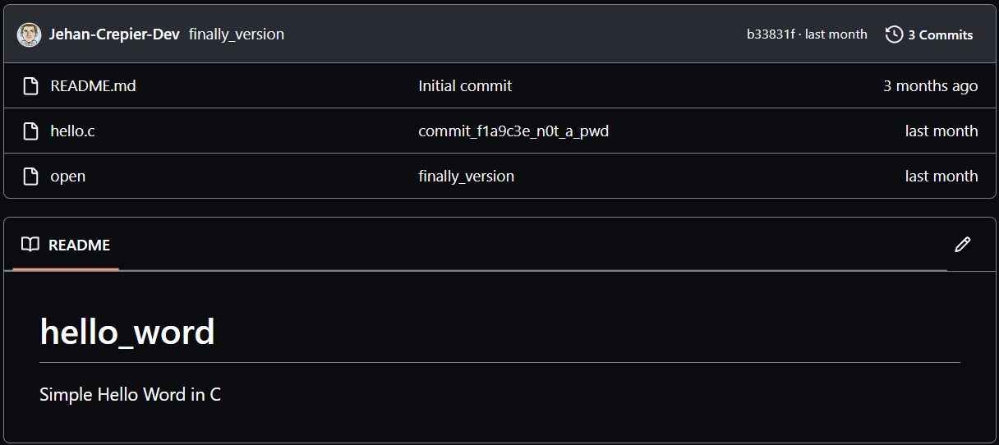

# Globecodeur à la Conquête du Secret
## Challenge

<p align="center">
    
</p>

## Solution

Après plusieurs scan avec *sherlock*, *blackbird* et *WhatsMyName*
```
JehanLecrepier jehanlecrepier jehan_lecrepier Jehan.Lecrepier jehan.lecrepier Jehan_Lecrepier j_lecrepier J_Lecrepier Jehan_L jehan_l Jehan.L jehan.L J.Lecrepier j.lecrepier JLecrepier JehanL JehanLC Jehan.LC JLC
```

Ainsi que des heures de recherche sur différents moteurs de recherche, je trouve seulement un *Telegram* : 

[+] Telegram: https://t.me/JehanLecrepier

<p align="center">
    
</p>

Celui-ci redirige vers un autre canal *Telegram*

* Join the project https://t.me/c0fidentiel_pr0ject_Jehan

<p align="center">
    
</p>

Tout celà est très intéressant, mais semble être la deuxième partie du challenge, il me manque des informations pour ouvrir le fichier Confidential-Open-Alone.pdf.<br />
Pdf que j'ai mis des heures à récupérer. On ne peut pas télécharger un fichier sur *Telegram* sans avoir un compte...

Après avoir *sherlock* encore une fois "JehanLecrepier" sous toutes ses formes, je copie-colle "Join the project https://t.me/c0fidentiel_pr0ject_Jehan" dans google dans un élan de désespoir et tombe sur 2 comptes *X* et *Github* :
* [X](https://x.com/CrepierJehan)
* [Github](https://github.com/Jehan-Crepier-Dev)

Il s'appel finalement *Jehan Crepier*, c'est pour ça que je ne trouvai pas.

<p align="center">
    
</p>

<p align="center">
    
</p>

<p align="center">
    
</p>

Son *X* nous indique d'aller sur *Github* qui contient pour seul repository un programme "hello word" qui écrit soit "Hello, World!", soit "Tu as trouvé l'easter egg!" si on lui donne "magique" en entrée :

```C
#include <stdio.h>
#include <stdlib.h>
#include <string.h>

int main() {
    char input[20];
    printf("Entrez le mot magique : ");
    scanf("%s", input);

    if (strcmp(input, "magique") == 0) {
        printf("Tu as trouvé l'easter egg!\n");
    } else {
        printf("Hello, World!\n");
    }

    return 0;
}
```

Le nom du commit sur le fichier hello.c ```commit_f1a9c3e_n0t_a_pwd``` est en fait le password du pdf, mais celui-ci est tout blanc, avec pour seul inscription "CONFIDENTIEL".

Cependant, il y a une ligne étrange, sélectionnable en milieu de page. Comme le hello World est "magique", je me dit que le pdf l'est peut-être aussi.

<p align="center">
    
</p>

Et c'est le cas, en copiant la ligne invisible dans le pdf on récupère cette phrase:
 ```Voici le flag : hEre_1s_Ze-good_pwd```

## Flag
```SHLK{hEre_1s_Ze-good_pwd}```