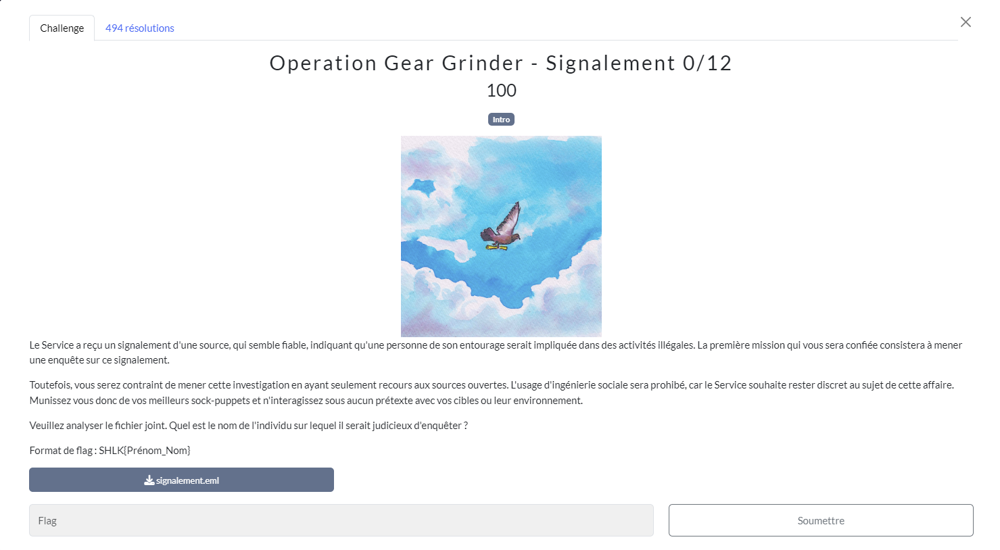
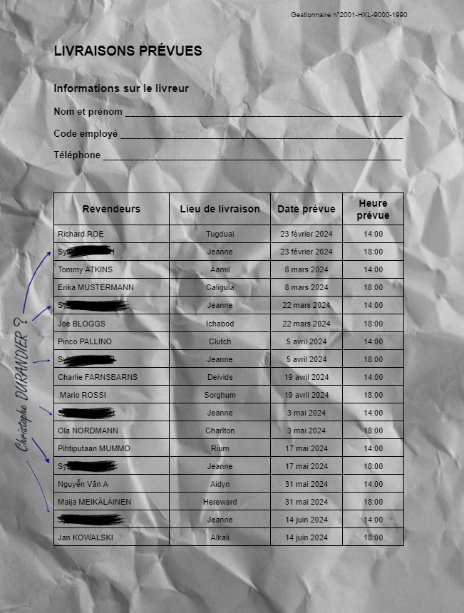

# Signalement
## Challenge

<p align="center">
    
</p>

## Solution
Le fichier signalement.eml en ressource est un format de fichier email.<br /> On peut l'ouvrir avec un logiciel de mail comme thunderbird. On y trouve le message, ainsi que la pièce jointe ci-dessous.

```
Madame, Monsieur,

Je vous écris pour vous faire part de mes préoccupations concernant des activités potentiellement illégales observées chez un individu résidant dans mon quartier.

L'individu en question se prénomme Christophe, et son comportement récent m'a paru suspect. Afin de mieux comprendre la situation, j'ai entrepris de surveiller ses activités de manière discrète. Hier soir, j'ai fouillé ses poubelles et j'y ai découvert une feuille contenant des informations étranges. Cette feuille comportait des noms, des mots aléatoires, ainsi que des dates et des heures, sans que je puisse en déterminer le contexte ou la signification exacte.

En tant que citoyen soucieux de la sécurité et du bien-être de la communauté, je vous transmets cette information afin que des enquêteurs compétents puissent vérifier la nature de ces activités. Il me semble important que cette situation soit évaluée par des professionnels afin de dissiper tout doute ou, le cas échéant, de prendre les mesures nécessaires.

Je me tiens à votre disposition pour toute information complémentaire ou pour répondre à vos questions concernant ce signalement.

Je vous remercie par avance de l'attention portée à ma démarche et vous prie de croire, Madame, Monsieur, en l’expression de mes salutations distinguées.
```

<p align="center">
    
</p>

Christophe DURANDIER est écrit sur la gauche de la pièce jointe.

## Flag
```SHLK{Christophe_Durandier}```