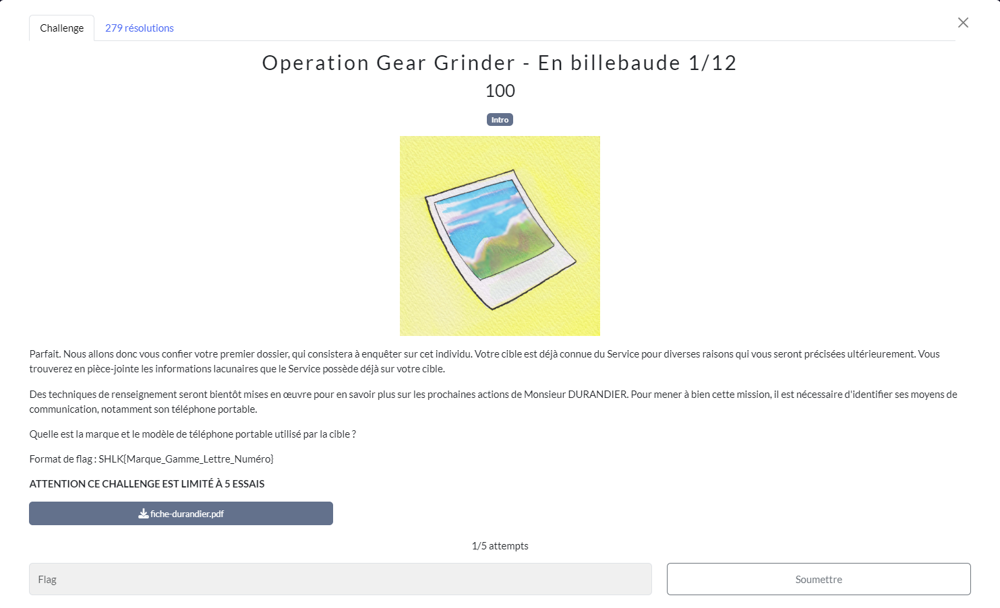
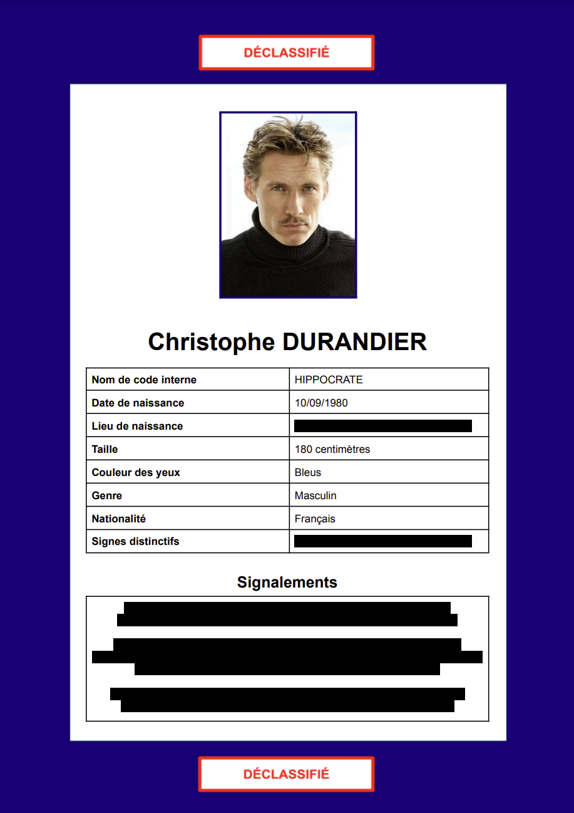

# En billebaude
## Challenge

<p align="center">
    
</p>

## Ressources

<p align="center">
    
</p>

## Solution

À l'aide de l'outil *sherlock*, *WhatsMyName* ou encore les *Google Dorks*, je cherche des réseaux sociaux et comptes au nom de Christophe Durandier.
J'essaye avec ou sans majuscules, et différentes combinaisons.
Je fini par trouver ceux-ci : 

* [Youtube](https://www.youtube.com/@christophedurandier)
* [Facebook](https://www.facebook.com/profile.php?id=61559973297615)
* [Flickr](https://www.flickr.com/photos/200605512@N03/)
* [Linkedin](https://www.linkedin.com/in/christophedurandier/)
* [Instagram](https://www.instagram.com/christophedurandier/)
* [Resalib](https://www.resalib.fr/praticien/91060-christophe-durandier-consultant-sante-paris)
* [TripAdvisor](https://www.tripadvisor.com/Profile/christophedurandier)

Maintenant j'aimerai trouver des métadatas dans les photos avec *exiftool* , mais elles sont supprimé dans les photos sur Instagram et Facebook.

Je me dit que si je peux trouver des infos sur une image, ça doit être dans Flickr qui est spécialisé dans la photo.

Et finalement, je trouve sur Flickr un bouton télécharger.

<p align="center">
    
</p>

Rien dans la première mais en persévérant, c'est dans la deuxième photos qu'on trouve la marque et le modèle du téléphone.

```
ExifTool Version Number         : 12.40
File Name                       : 2_53742039568_o.jpg
Directory                       : .
File Size                       : 611 KiB
File Modification Date/Time     : 2024:07:22 18:35:48+02:00
File Access Date/Time           : 2024:07:23 19:38:43+02:00
File Inode Change Date/Time     : 2024:07:22 18:35:48+02:00
File Permissions                : -rw-r--r--
File Type                       : JPEG
File Type Extension             : jpg
MIME Type                       : image/jpeg
JFIF Version                    : 1.01
Resolution Unit                 : None
X Resolution                    : 1
Y Resolution                    : 1
Exif Byte Order                 : Big-endian (Motorola, MM)
Make                            : Samsung
Camera Model Name               : Galaxy 22
Artist                          : Christophe Durandier
Image Width                     : 1344
Image Height                    : 896
Encoding Process                : Baseline DCT, Huffman coding
Bits Per Sample                 : 8
Color Components                : 3
Y Cb Cr Sub Sampling            : YCbCr4:2:0 (2 2)
Image Size                      : 1344x896
Megapixels                      : 1.2
```

Il n'y a pas de modèle Galaxy 22, je rajoute donc un S.
## Flag
```SHLK{Samsung_Galaxy_S_22}```