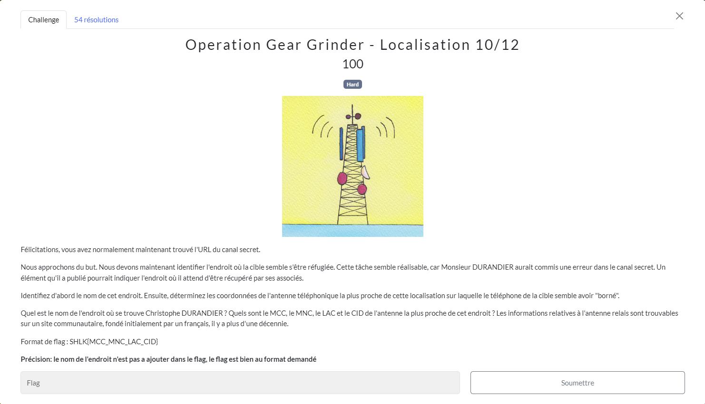
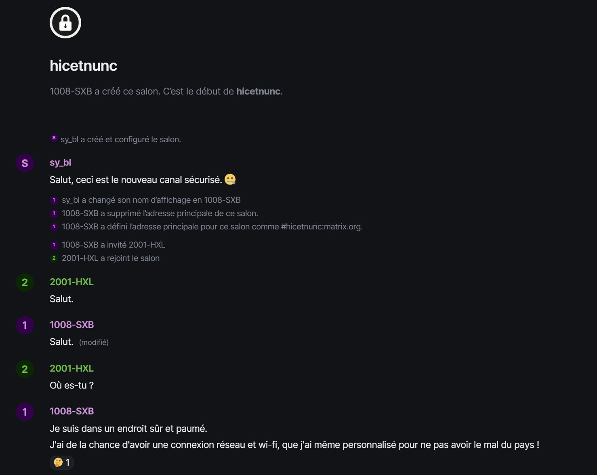
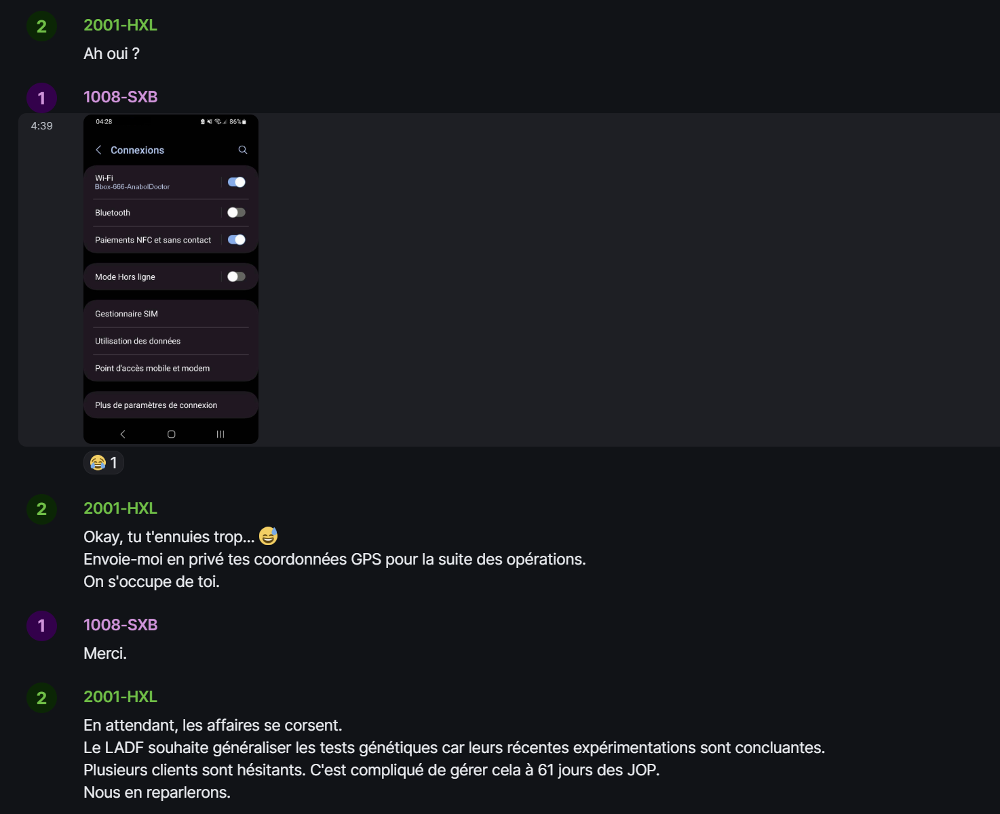
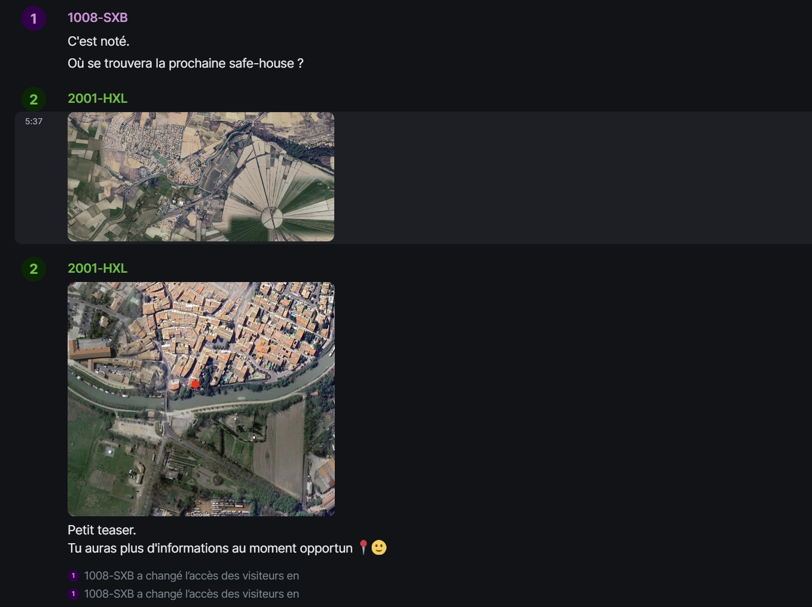
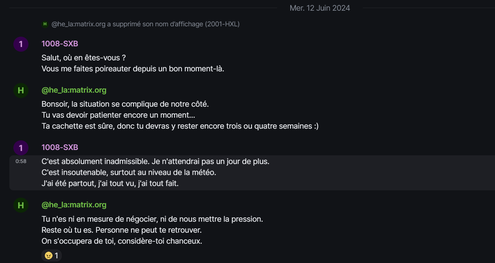
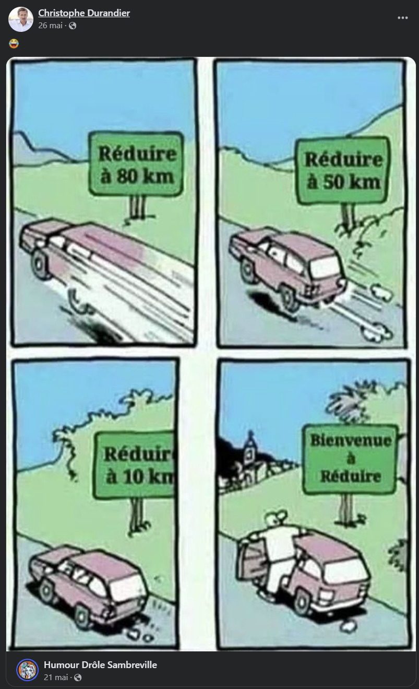
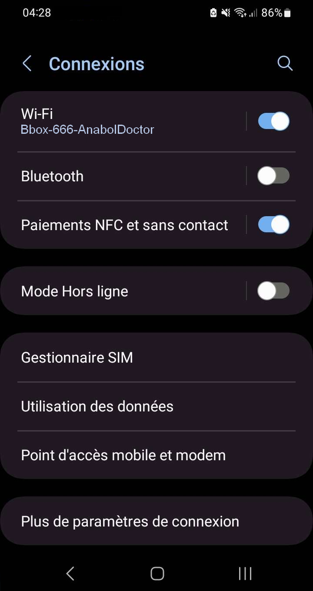

# Localisation
## Challenge (non résolu dans les temps)

<p align="center">
    
</p>

## Solution

Ici nous cherchons l'endroit où se cache christophe Durandier, mais surtout l'antenne téléphonique la plus proche.

Il faut commencer par accéder au salon ```hicetnunc```, via le client ```element```, sur le protocol ```matrix```, ce qui est faisable dans un navigateur web ([element web app](https://app.element.io/)).<br/>
J'avais déjà réalisé cette étape dans le challenge précédent.

On y découvre la conversation suivante :

<p align="center">
    
    
    
    
</p>

On peut noter plusieurs informations :

* Christophe Durandier = Sylvano Bloch = sy_bl = 1008-SXB

* Helena Laestia = he_la = 2001-HXL

* Il est dans un endroit "sûr et paumé".

* Il a le mal du pays, il est donc certainement à l'étranger.

* Il est connecté à un réseau Wifi et en a modifié le nom en ```Bbox-666-AnabolDoctor```.

* Il y a des photos satellites de sa prochaine cachette.

J'ai commencé par chercher l'adresse de sa prochaine destination avec les images satelites
Avec *GoogleLens* je trouve l'endroit, apparemment l'[etang montady](https://planet-terre.ens-lyon.fr/objets/Images/Img269/269-amenagement-etang-montady-05.jpg/image_view_fullscreen).

Je retrouve ensuite ses coordonnées sur un moteur de recherche : ```43° 19′ 09″ N, 3° 07′ 17″ E```

On remarque que les photos sont retournées.

Je les entre dans *Googlemaps* et active la vue sattelite.

Je trouve sa prochaine destination : [Au Lavoir](https://www.google.com/maps/place/Au+Lavoir/@43.3149952,3.1390716,120m/data=!3m1!1e3!4m9!3m8!1s0x12b108f7f661627d:0xca8401c3d96eda2d!5m2!4m1!1i2!8m2!3d43.3151833!4d3.1393496!16s%2Fg%2F1pp2t_27t?entry=ttu) avec un free-wifi.

On a maintenant besoin du *"site communautaire, fondé initialement par un français, il y a plus d'une décennie"*, pour obtenir les codes de l'antenne téléphonique.

Il existe plusieurs sites répertioriant les antennes, mais un seul correspond à la description : [OpencellID](https://opencellid.org/).<br/>
On peut en être sûr grâce à sa description [Wikipédia](https://en.wikipedia.org/wiki/OpenCellID), OpencellID est d'origine française et a été créé en 2008.

Aucune antenne aux alentours de "Au Lavoir" ne valide le flag, et c'est normal car il fallait trouvé sa cachette actuelle et non la future...

J'ai suivi différentes pistes comme des posts *Facebook* qui pouvait faire penser qu'il soit en Belgique ou dans le village de "La Réduire".

<p align="center">
    
</p>

Encore une fois, que des fausses pistes...

C'est après avoir exploré la planète entière, dans les dernières heures du CTF, que je me suis dit que j'avais du rater quelque chose.<br/>
Le fait qu'il ait changé son wifi semble être une bonne piste et mon dernier espoir!

<p align="center">
    
</p>

Je m'étais déjà renseigné dessus, mais apparemment trop vite. Il me semblait avoir lu qu'on ne puisse pas modifier son SSID mais on peut le faire dans les wifi public.

[*Wigle*](https://wigle.net/) est un site qui permet de géolocaliser un wifi à partir de son SSID.

Pour finir, j'ai rencontré des problèmes de limite quotidienne de recherche sur *Wigle* et j'ai malheureusement été pris par le temps.

## Flag
```SHLK{P45_3u_13_73mP5}```