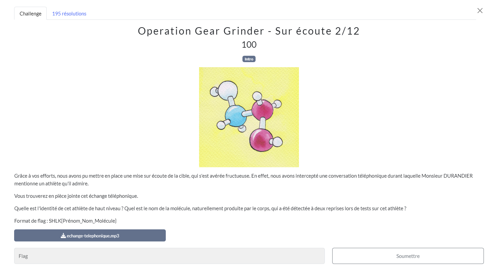

# Sur écoute
## Challenge

<p align="center">
    
</p>

## Ressources

<p align="center">
    <audio controls src="./ressources/echange-telephonique.mp3"></audio>
</p>

## Solution

Ici nous devons retrouver un athlète avec les informations entendues dans l'audio en ressources :
* Un peu plus petit que Christophe Durandier (1m80)
* Né le jour où la Renault 16 à été lancé en 1965.
* Né dans le pays de l'Eurovision 1965, en Italie.
* Discalifier de tous les concours pour les 35 prochaine annee

Après beaucoup de recherche sur les athlètes... J'ai finalement trouvé en tappant "athlète italien dopage 2 reprises" sur *Brave Search*

[Wikipédia Roberto Barbi](https://fr.wikipedia.org/wiki/Roberto_Barbi)

Il s'est dopé plusieurs fois, mais la molécule qu'il a pris à deux reprises est l'EPO 
## Flag
```SHLK{Roberto_Barbi_Epo}```