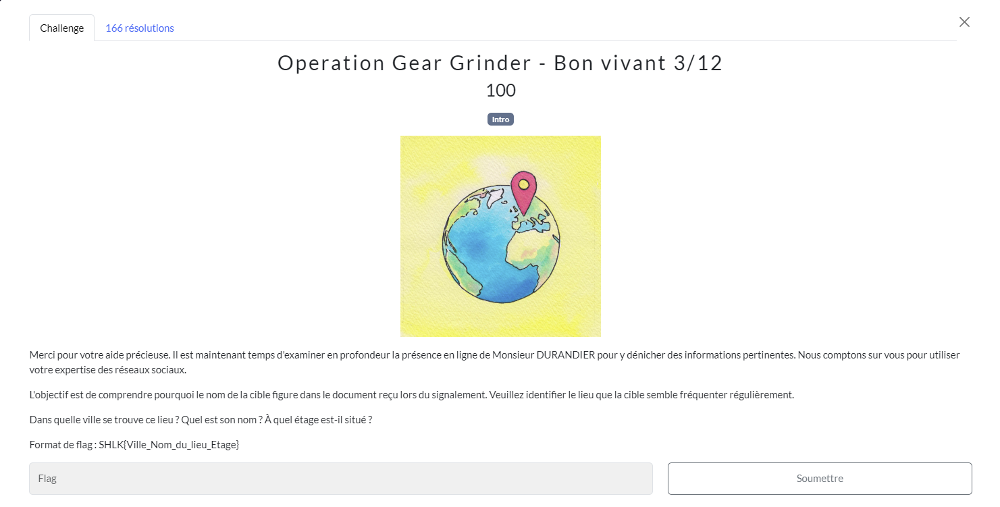
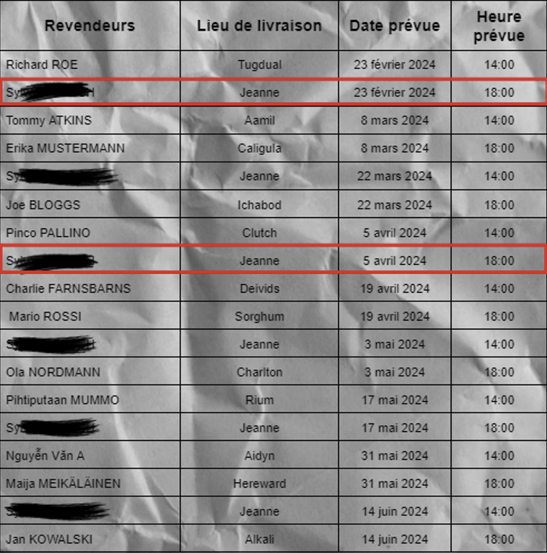
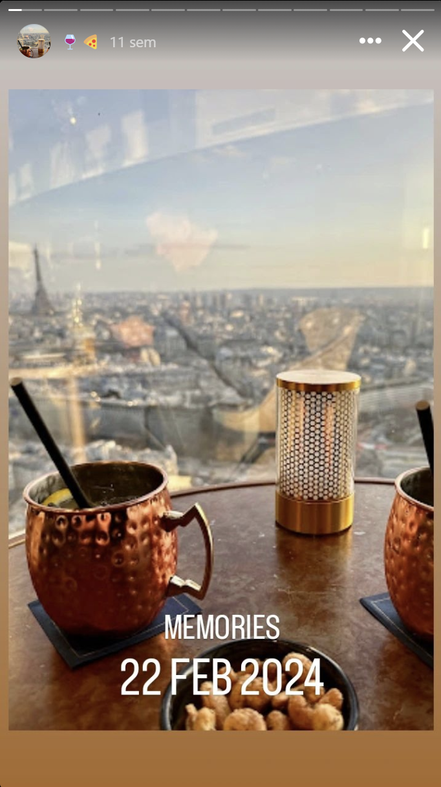
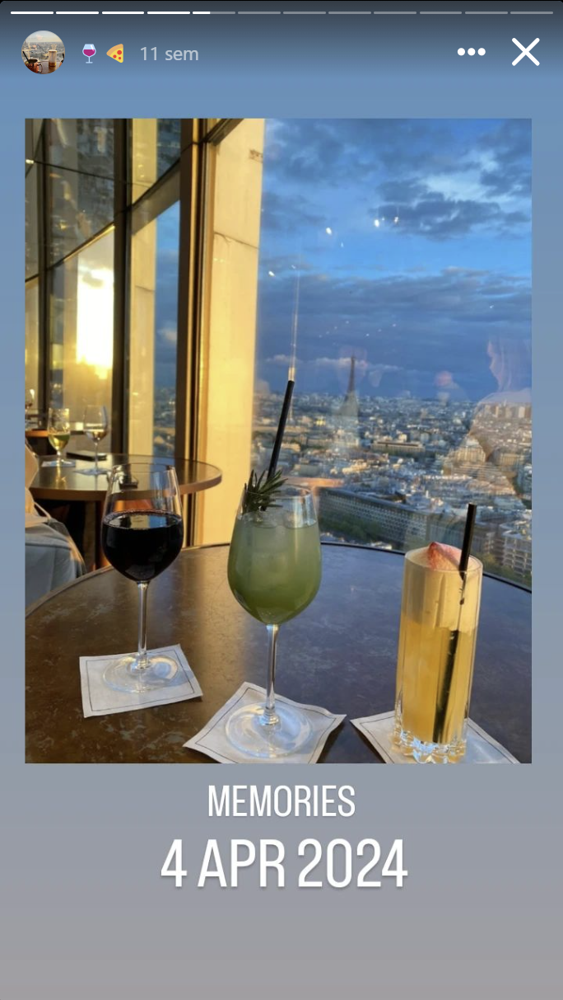

# Bon vivant
## Challenge

<p align="center">
    
</p>

## Solution

À ce niveau là, j'avais déjà bien examiner les réseaux de Monsieur Durandier.

Je me dirige donc vers son [Instagram](https://www.instagram.com/christophedurandier/), dans sa story sur les bars et restaurants, on remarque des dates qui précèdent celles des rendez-vous sur la feuille du challenge 1/12.

<p align="center">
    
</p>

<p align="center">
    
</p>

<p align="center">
    
</p>

J'en déduit que c'est le lieu de rendez-vous.

Je me se doute que c'est à Paris avec la tour Effeil.<br />En faisant une capture d'écran de ces stories et en les passants dans *Google Lens*, je trouve *Windo Skybar*.<br />Je n'ai plus qu'à trouver l'étage avec *Google Maps*.

C'est au 34ième étage.

## Flag
```SHLK{Paris_Windo_Skybar_34}```