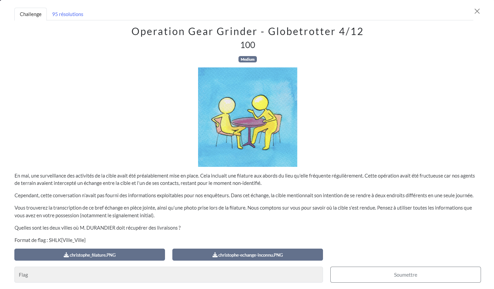
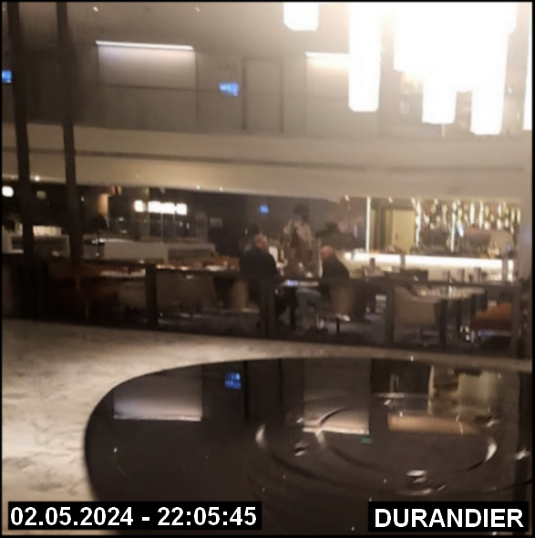
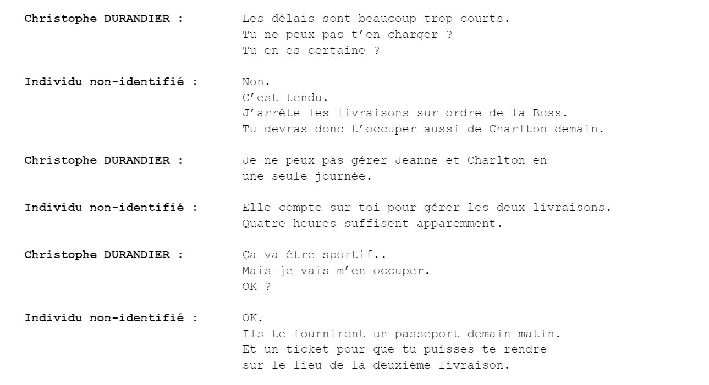
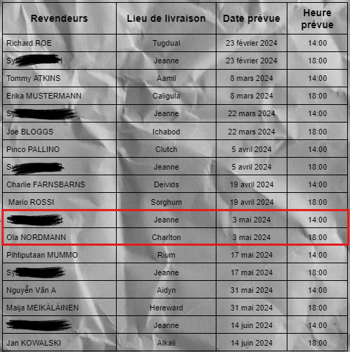
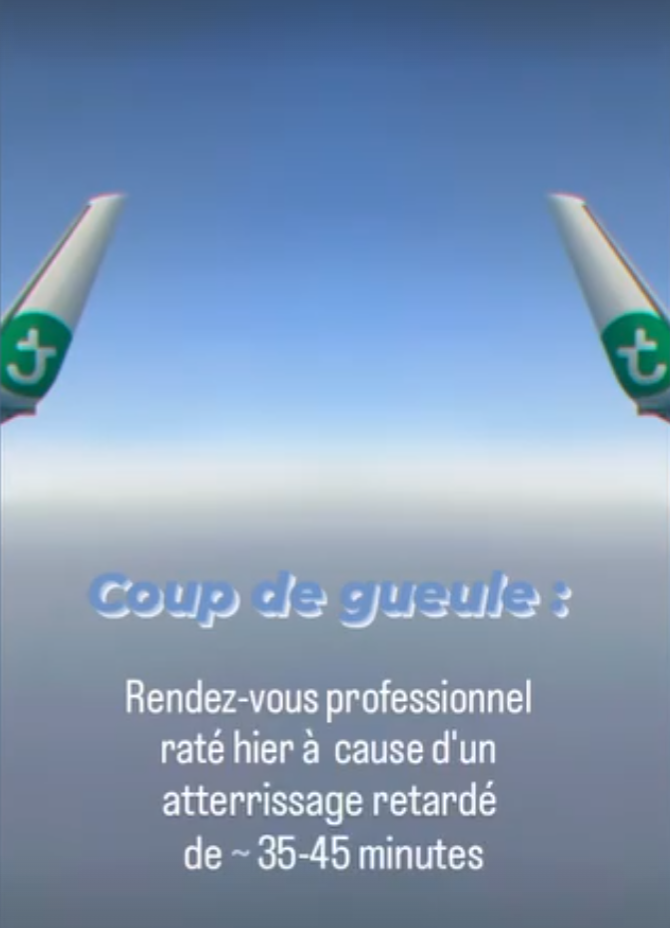
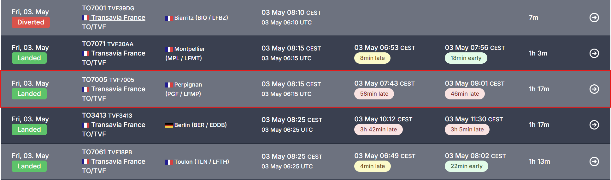
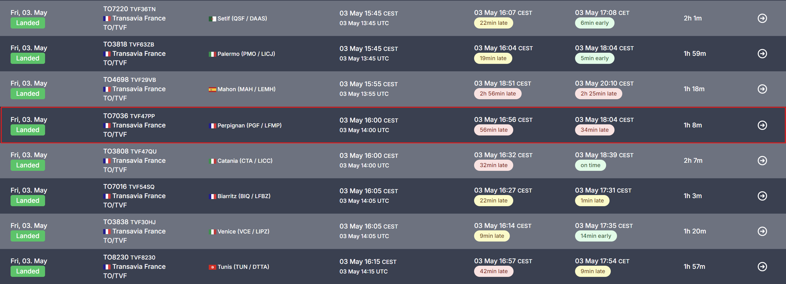

# Globetrotter
## Challenge

<p align="center">
    
</p>

## Ressources

<p align="center">
    
</p>

<p align="center">
    
</p>

## Solution

Dans ce challenge, nous devons retrouver deux noms de villes, dans lesquelles Christophe Durandier doit récupérer des livraisons.

Avec les ressources, on apprend que :
* Mr Durandier va devoir effectuer deux livraisons dans la même journée.

* Quatre heures suffisent tout juste pour se rendre sur les deux lieux de livraisons (Jeanne et Charlton).

* Son interlocuteur est une fille.

* La photo prise lors de la filature date du 2 mai 2024 au soir, les livraisons auront donc certainement lieux le lendemain (3 mai).

* Il a besoin d'un ticket et d'un passeport pour se rendre sur le deuxième lieu.

Nous avons des livraisons qui correspondent à ces indices sur la feuille récupérée à la fin du premier challenge.

<p align="center">
    
</p>

Il faut ajouter à ces indices, tout ce que nous avons trouvé auparavant sur les réseaux sociaux et plus particulièrement [Instagram](https://www.instagram.com/christophedurandier/), sur lequel on voit une story contenant la photo de l'aile d'un avion et mentionnant un retard de 35-45 minutes le 3 mai.

<p align="center">
    
</p>

En cherchant ce logo dans *GoogleLens*, on apprend que l'avion appartient à la compagnie *Transavia*, qui a par ailleur, réputation d'être souvent en retard, ce qui ne nous arrange pas.

On sait que Christophe Durandier habite à Paris, et qu'il fait ses livraisons à "Jeanne" à chaque fois. Jeanne est donc certainement Paris.

Mais ici on commencé les problèmes... C'est sur ce challenge que j'ai dû perdre le plus de temps, les indices pour trouver "Charlton" n'étant pas très précis. Je pense être tombé dans tous les rabbit hole possible, y compris certains qui n'avait pas lieu d'être. 😅

Je ne vais pas énumérer toutes mes fausses pistes, mais en voici quelques une intéressantes :

* Charlton étant un quartier de Londres, Londres pourrait être Charlton.<br/>
* Jeanne pourrait aussi être Toulouse ([Jeanne de Toulouse](https://fr.wikipedia.org/wiki/Jeanne_de_Toulouse)).<br/>
* On remarque, dans ses stories que Christophe aime les SPA et le sud de la France.
* Utiliser le site de [Transavia](https://www.transavia.com/destinations/fr-fr) qui récapitule toutes leurs destinations. Sauf que quand je l'ai fait, je mettais Toulouse à la place de Paris car j'avais trouvé de ses posts Instagram sur lequel il mentionnait être aller voir un concert un Toulouse...

Il existe différents sites internet pour retrouver des avions qui ont voyagés par le passé, mais la plupart sont payants.<br/>
J'ai essayé plusieurs freetrial sur ces sites sans succès, les interfaces n'étant pas intuitives.<br/>
De plus, il fallait bien faire attention à calculer pour être en UTC+2, ce que je n'ai pas bien fait sur mes premiers essais.

C'est donc quasiment en bruteforçant tous les avions en retard de 35-45 min, le 3 mai 2024, que j'ai validé le challenge avec un vol Perpignan-Paris.

Je me suis concentré sur le site [flightera](https://www.flightera.net/), qui est gratuit est sur lequel on voit mieux les retards.

<p align="center">
    
</p>

Sauf que les horaires ne correspondaient pas à un retard aux alentours de 18 heures et j'avais mis Perpignan-Paris au lieu de Paris-Perpignan... Oui, j'étais un peu fatigué.

J'ai finalement trouvé un avion qui correspondait dans le challenge suivant.

<p align="center">
    
</p>

Merci aux organisateurs d'avoir accepté les villes dans les deux sens, sans quoi je ne sais pas si j'aurai réussi ce challenge!

## Flag
```SHLK{Paris_Perpignan}```