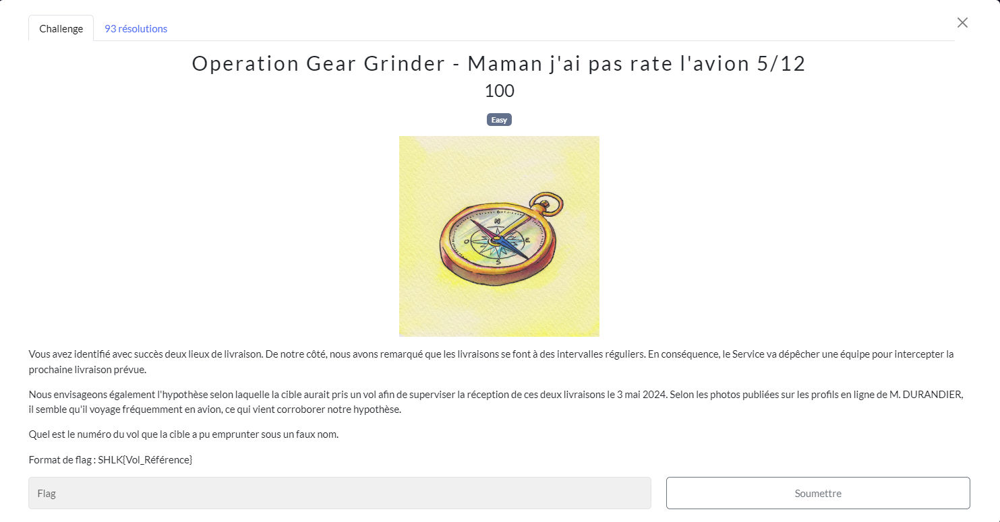

# Maman j'ai pas raté l'avion
## Challenge

<p align="center">
    
</p>

## Solution

Ce challenge était gratuit, si on avait bien réalisé le précédent.

Il est donc temps de réparer nos erreurs et comprendre pourquoi les horaires de l'avion me parraissaient étranges.

De retour sur [flightera](https://www.flightera.net/), pour éplucher les vols Paris-Perpignan et Perpignan-Paris en retard de 35-45 minutes pour une arrivée prévu avant 18 heures.

* J'avais à la base inversé Paris et Perpignan (pour le départ et l'arrivée)...<br/>
* L'avion a attéri à 18h04, ce qui correspond au fait que Christophe Durandier était en retard pour sa seconde livraison.

<p align="center">
    
</p>

Le numéro de vol est bien ```TO7036```, et non pas ```TVF47PP```

## Flag
```SHLK{TO_7036}```