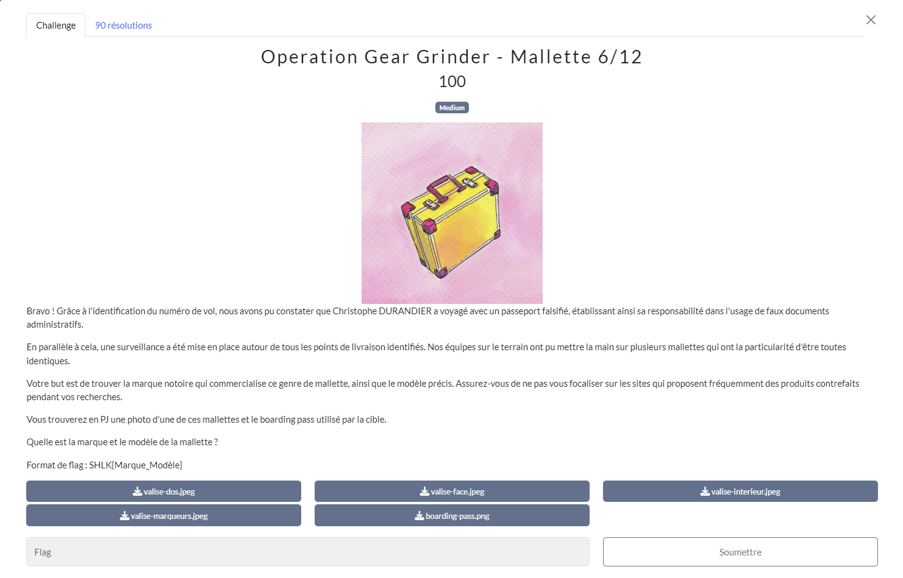

# Malette
## Challenge

<p align="center">
    
</p>

## Ressources

<p align="center">
    
</p>
<p align="center">
    
</p>
<p align="center">
    
</p>
<p align="center">
    
</p>
<p align="center">
    
</p>

## Solution

On peut noter le nom de code de Christophe Durandier qui était rayé sur la feuille du 1/12 : *Sylvano Bloch*

Toujours avec *Google lens*, je me renseigne sur ces photos de valise.<br/>Je passe d'abord la première photo sans succès, puis me dit que la dernière, celle avec le marqueur et les flèches est plus particulière.
Elle me mène directement sur un *Reddit* contenant un post avec exactement toutes les photos!

* [Reddit](https://www.reddit.com/r/pelicancase/comments/1atr29c/does_it_look_like_pelican_case/)

C'est donc une pelican case, il ne manque plus qu'à trouver le modèle.

En lisant les commentaires du thread reddit et observant les photos supplémentaires postées sur celui-ci. On comprend vite que c'est une 1450.

<p align="center">
    
</p>

Ne connaissant pas les Pelican Case, je vérifie si ce modèle existe bel et bien. Et oui, c'est le cas.

## Flag
```SHLK{Pelican_1450}```