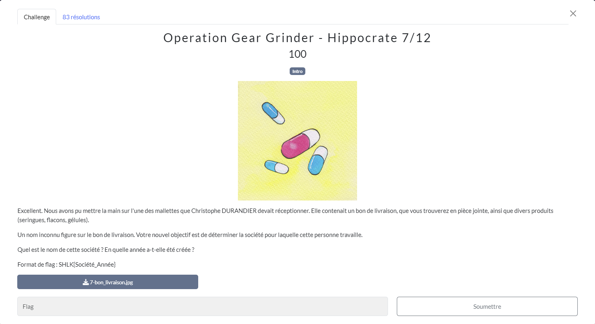
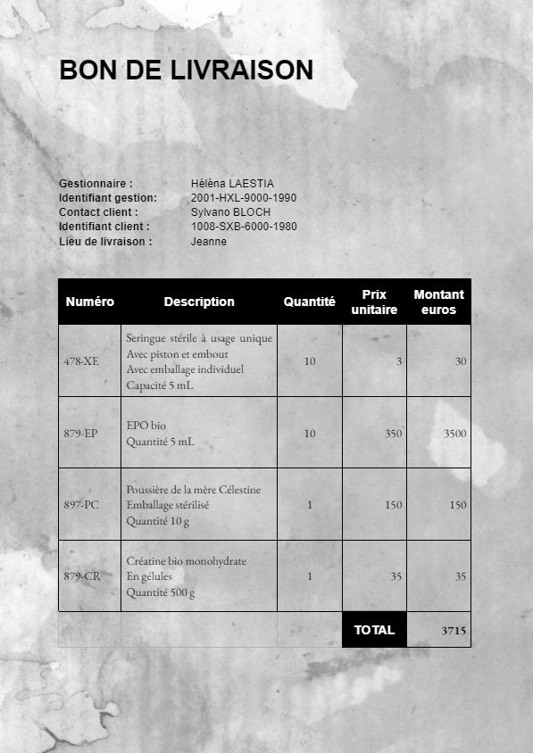
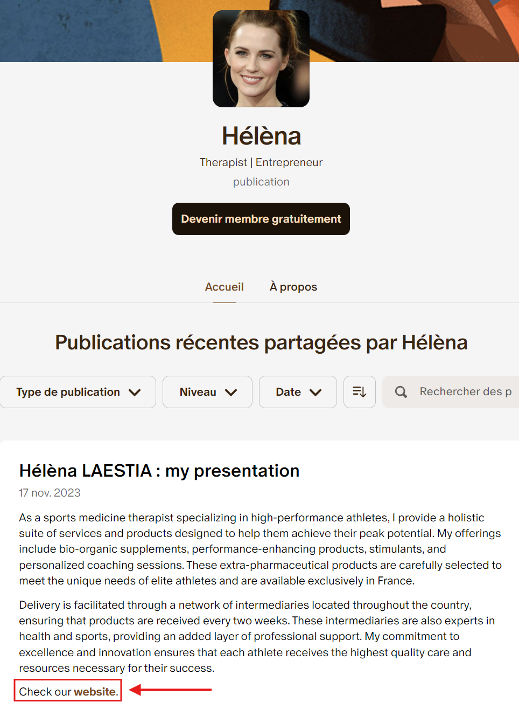

# Hippocrate
## Challenge

<p align="center">
    
</p>

## Ressources

<p align="center">
    
</p>

## Solution

Le bon de livraison en ressource nous indique un nom de gestionnaire : hélèna LAESTIA.

C'est certainement un nom de code comme Sylvano Bloch mais c'est la seule piste.

En cherchant ce nom dans *Google*, je trouve un blog *medium* : https://medium.com/@HeleleLALA

<p align="center">
    
</p>

Dans la description de ce blog, on apprend qu'elle serait sur *Patreon*, seulement je ne trouve rien en cherchant dans *Google*.

Le "@HeleleLALA" m'intrigue, elle aurait peut-être d'autre compte sous le même pseudonyme.
Avec *WhatsMyName* je trouve son 
[Patreon](https://www.patreon.com/helelelala)

<p align="center">
    
</p>

À la fin de la publication, je trouve un lien vers le website de sa société dans sa description patreon : https://anabolexperts.wixsite.com/anabolexperts

Le nom de l'entreprise est donc AnabolExperts, pour trouver l'année de création de l'entreprise, il faut se rendre dans la rubrique "à propos" de leur site.

<p align="center">
    
</p>

L'année est 2020.

## Flag
```SHLK{AnabolExperts_2020}```