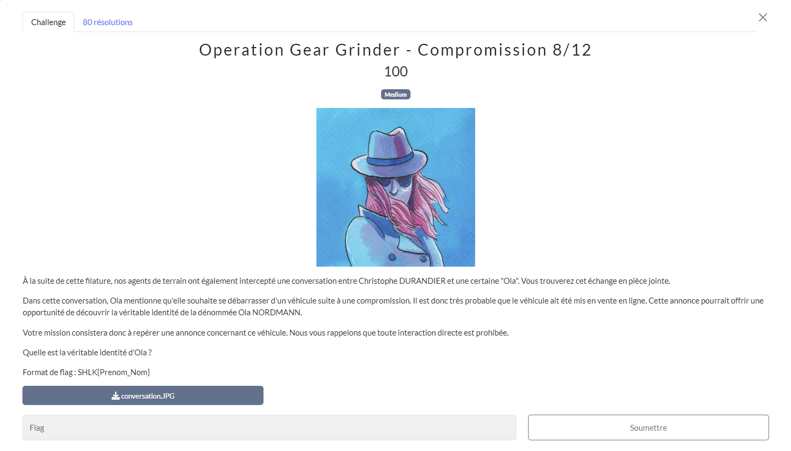
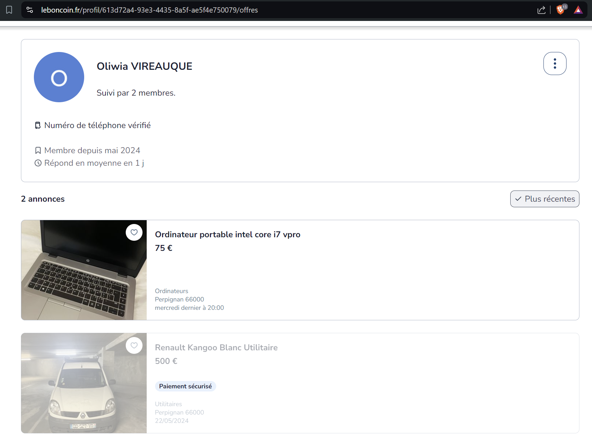

# Compromission
## Challenge

<p align="center">
    
</p>

## Ressources

<p align="center">
    
</p>

## Solution

Dans cette discussion; on peut récolter plusieurs informations :
* Date : 20 mai 2024
* Vehicule d'occasion
* Utilitaire (livraison)
* Blanc cabossé
* Marque de ventouse sur le capot
* Scotch sur le coffre
* Immatriculation : BD-527-YR

Comme elle vend aussi son matos, je me dit que j'aurai plus de chance sur *leboncoin* que sur un site de vente automobile d'occasion.
J'y fais une recherche avancée, autour de Perpignan (Charlton) son lieu de livraison, utilitaire blanc, classé par ancienneté (les plus ancienne d'abord), et cherche aux alentour du 20 mai 2024

Je trouve un kangoo qui correspond à la description, la vendeuse *"Oliwia Vireauque"* (la fille du directeur d'AnabolExperts?), propose aussi un ordinateur portable.

<p align="center">
    
</p>

## Flag
```SHLK{Oliwia_Vireauque}```