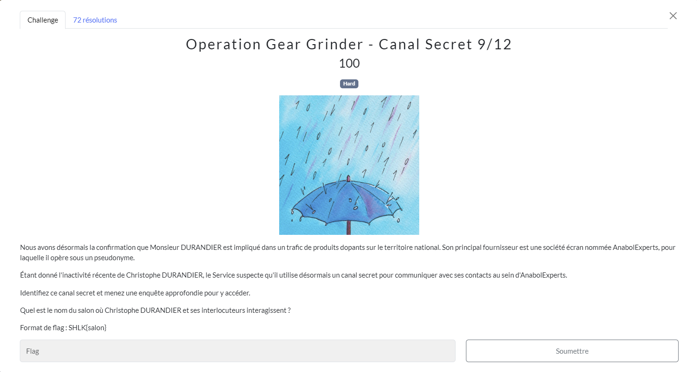
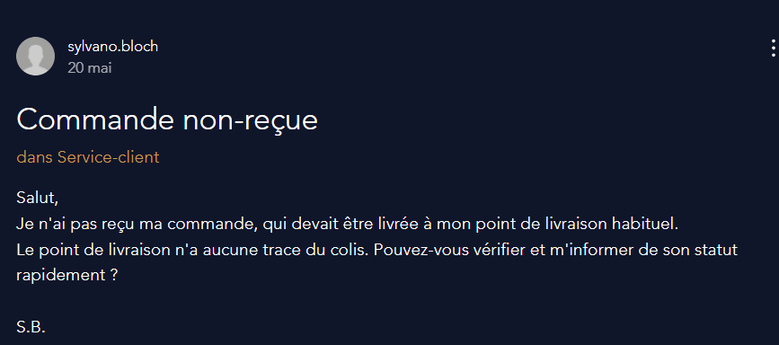
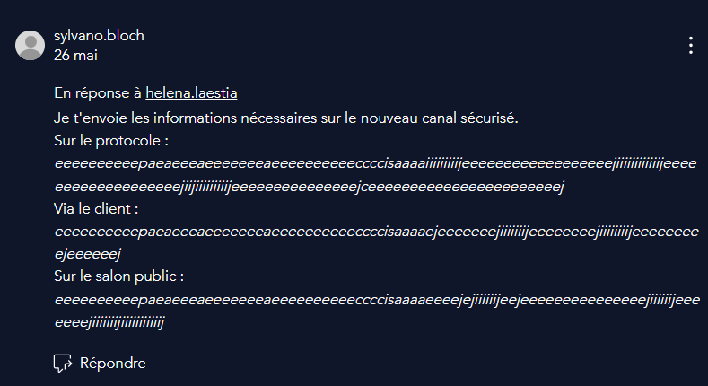

# Canal Secret
## Challenge

<p align="center">
    
</p>

## Solution

Dans ce challenge nous cherchons un canal secret sur lequel Christophe Durandier pourrait communiquer avec ses associés.

Étant donné qu'on nous parle d'[AnabolExperts](https://anabolexperts.wixsite.com/anabolexperts) dans l'énoncé, allons explorer leur site plus en profondeur.

On voit  dans la rubrique "[À Propos](https://anabolexperts.wixsite.com/anabolexperts/%C3%A0-propos)" de leur site que le pseudonyme de *Christophe Durandier* est *Sylvano Bloch*.<br/>
Celui-ci y a laissé un message sur le service-client le 26 mai à propos d'une commande non recue : 

https://anabolexperts.wixsite.com/anabolexperts/demander-%C3%A0-l-expert/service-client/commande-non-recue

<p align="center">
    
</p>

Si l'on lit les réponses à ce message, on y découvre des indications pour rejoindre un canal sécurisé, mais celles-ci semblent chiffrées :

<p align="center">
    
</p>

Lorsque l'on découvre un message chiffré, on peut essayer de l'identifier sur [dcode.fr/identification-chiffrement](https://www.dcode.fr/identification-chiffrement).

L'identification nous dit que ce chiffrement semble être du [*Alphuck*](https://esolangs.org/wiki/Alphuck), un dérivé du *Brainfuck* que je ne connaissais pas, qui remplace les charactères spéciaux du Brainfuck par des lettres.

On pourrait le décoder nous même mais *dcode* le fait déjà très bien : [dcode.fr/langage-alphuck](https://www.dcode.fr/langage-alphuck).

Ce qui nous donne :

* Protocole :
    * ``` [matrix]``` 

* Client :
    * ```element```

* Salon public :
    * ```hicetnunc```

On peut dorénavant se connecter à leur canal sécurisé, ce que je ferai dans le prochain challenge.
Ici il nous fallait seulement le nom du salon public.

## Flag
```SHLK{hicetnunc}```